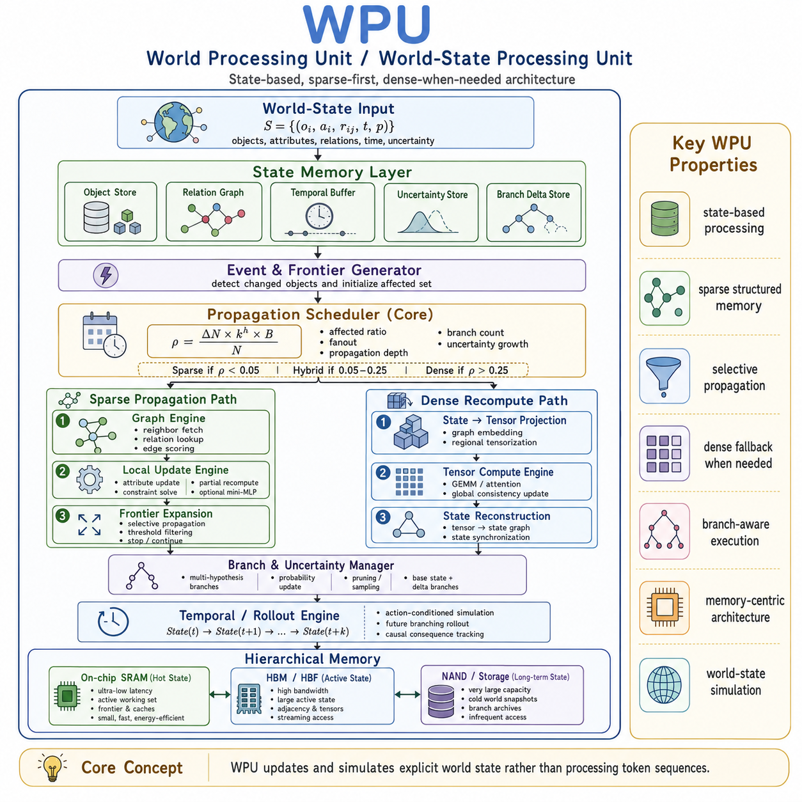
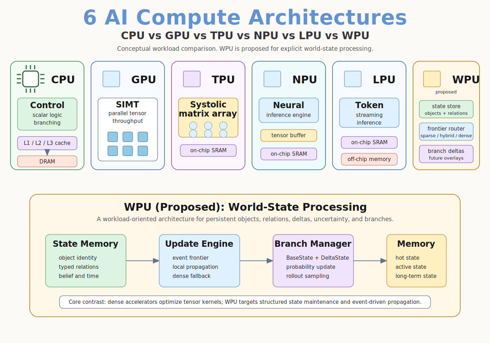
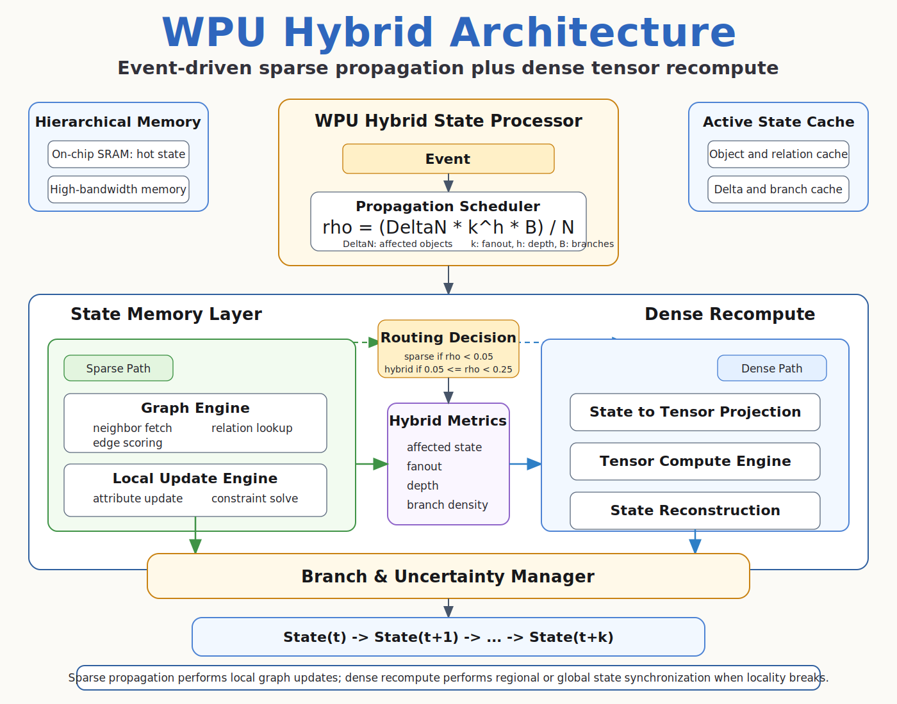

# WPU: World-State Processing Unit

[](https://github.com/eljja/WPU/actions/workflows/ci.yml)



이 저장소는 **State Is All You Need**와 **World-State Processing Unit
(WPU)** 아이디어의 첫 PyTorch 연구 prototype이다.

WPU는 chatbot memory도 아니고, Transformer의 보편 대체재도 아니며, 아직 완성된
chip design도 아니다. 현재 목표는 world processing을 token sequence가 아니라
명시적 world state의 유지, 갱신, 전파, 분기 문제로 다루는 reference implementation과
실험 scaffold를 만드는 것이다.

중심 primitive는 **객체화(objectification)** 다. 즉 세계를 persistent하고 addressable한
객체로 변환하고, 그 객체의 state, relation, uncertainty, delta, branch overlay를 직접
갱신할 수 있게 만드는 것이다. 객체화는 단순히 type label을 붙이는 일이 아니다.
Role, affordance, geometry, confidence, history처럼 relation을 지탱하는 state
variable이 필요하다. 정의는 `docs/objectification.ko.md`에 둔다.

## 핵심 주장

Token sequence는 세계를 설명할 수 있지만, world-state operation을 first-class로
만들지는 않는다. WPU는 다음 요소를 기본 계산 단위로 둔다.

- persistent object/relation state
- event frontier generation
- local causal propagation
- sparse, hybrid, dense execution routing
- full-state rewrite가 아닌 delta-state patching
- multiple futures를 위한 branch overlay
- uncertainty와 branch probability update

핵심 구분은 다음이다.

```text
Token = ordered evidence for append / attend
State = persistent substrate for patch / propagate / branch
```

현재 주장은 보편 우월성이 아니다. WPU가 유리한 조건은 `N`이 크지만 실제 event가
참조하고 갱신해야 하는 causal working set `K`가 작고 식별 가능할 때다. 즉 WPU는
large state, local causal change, persistent identity, branching이 지배적인 regime을
목표로 한다.

## Compute Context



CPU/GPU/TPU/NPU/LPU는 각자 다른 workload에 최적화되어 있다. WPU는 dense matrix
compute나 deterministic token stream이 아니라 다음 workload를 정의한다.

```text
World-state maintenance and update
```

따라서 hardware claim은 아직 미래 가설이다. 현재는 software runtime 수준에서
frontier queue, relation fetch, scatter/gather, sparse kernel, delta log, branch
overlay 비용을 계측하며 regime을 찾는 단계다.

## Hybrid Execution Architecture



v1 reference model은 event-driven sparse propagation과 dense tensor recompute
fallback을 함께 사용한다. Scheduler는 affected-state ratio, fanout, propagation
depth, branch pressure를 보고 sparse/hybrid/dense path를 선택한다. Scheduler는
objectification score도 사용한다. Identity/relation/delta 품질이 낮으면 blind
sparse routing을 피하고 hybrid 또는 dense recompute로 올린다.

```text
rho = (DeltaN * fanout^depth * branches) / N
```

## Repository Layout

```text
wpu/                 PyTorch package and state/model implementation
tests/               Unit and smoke tests
demos/               End-to-end dataflow demo
scripts/             Training, evaluation, sweeps, plotting
docs/arxiv/          English LaTeX paper, Korean companion, generated PDF
docs/experiments/    Experiment reports
docs/figures/        Paper figures and README diagrams
docs/Review/         External review notes and response matrix
```

## 설치

Python 3.11+ 권장.

```bash
python -m pip install -e ".[dev]"
```

기본 설치는 standard PyTorch package를 함께 설치한다. 특정 CUDA build가 필요하면
해당 PyTorch build를 먼저 설치한 뒤 editable install을 실행한다.

Windows에서는 `python`이 Microsoft Store alias로 잡히지 않는지 먼저 확인한다.
로컬 재현에는 다음처럼 venv interpreter를 명시하는 경로가 안전하다.

```powershell
python -m venv .venv
.\.venv\Scripts\python.exe -m pip install -e ".[dev]"
.\.venv\Scripts\python.exe -m pytest
```

## 데모 실행

```bash
python demos/robot_cup_demo.py
```

출력 trace:

- event와 initial frontier
- scheduler decision: sparse, hybrid, dense
- changed objects와 relation updates
- stable/falls/caught branch probabilities
- base state, deltas, branches memory estimate

## 최소 Public API

설치 후 핵심 state-processing 흐름은 package root에서 바로 사용할 수 있다.

```python
import wpu
from wpu.data.object_physics import create_robot_cup_state, create_touch_event

state = create_robot_cup_state()
event = create_touch_event()

event_delta = wpu.StateStore(state).apply_event(event)
sparse_delta = wpu.SparsePropagationEngine(max_depth=1).sparse_propagate(state, event).delta
dense_delta = wpu.DenseRecomputeEngine().dense_recompute(state, region=["cup_001"]).delta
objectification = wpu.evaluate_objectification(state, delta=event_delta)

print(event_delta.object_updates["cup_001"])
print(sparse_delta.object_updates["cup_001"])
print(dense_delta.object_updates["cup_001"])
print(objectification.contract_score)
```

이것이 v1의 의도된 interface다. Explicit world state는 event delta로 patch되고,
local propagation을 거친 뒤, 필요하면 제한된 dense region에서 recompute된다.
`evaluate_objectification`은 propagation 전에 supplied state가 WPU object contract를
만족하는지 검사한다. 즉 stable identity, valid relation endpoint, confidence,
valid delta, optional causal-working-set locality를 확인한다.

Object identity는 있지만 local relation extraction이 edge를 놓친 경우,
`repair_objectification_relations`는 sparse propagation 전에 보수적인
geometry-inferred relation patch를 추가할 수 있다. 이것은 state repair heuristic이지
물리 법칙을 해결했다는 주장이 아니다. Repair probe는 typed objectification이 왜
중요한지 보여준다. Geometry-only repair는 frontier recall을 복구하지만 distractor를
붙일 수 있고, type-gated repair는 controlled case에서 precision을 유지한다. 작은
learned relation scorer는 type gate와 같은 결과를 내고, 더 조밀한 distractor에서도
precision을 유지하며, role/affordance state variable이 보존되면 aliased type name을
넘어 transfer한다. 반대로 type과 role 정보가 모두 제거되면 실패하므로, 객체화의
경계가 측정 가능해진다. 같은 toy probe는 downstream branch prediction도 측정한다.
Role-aware learned repair는 aliased-type accuracy를 `0.343750`에서 `0.671875`로
올리고 loss를 `1.319667`에서 `0.885275`로 낮춘다. Ungated dense-distractor repair는
frontier recall을 복구하지만 loss를 악화시킨다.

두 번째 toy probe는 장기 객체화 방향을 테스트한다. Type name이 아니라 object
history에서 relation candidate를 학습하는 방식이다. `contact_transfer`와
`support_transfer`로 학습한 history scorer는 held-out `hidden_field`로 transfer하여
5개 seed 평균 relation precision/recall `0.987500`, downstream accuracy
`0.992188`를 기록한다. No-relation 또는 type prior는 `0.494531`에 머문다.
이것은 synthetic hidden-mechanism diagnostic이지 실제 물리 법칙 발견 증거는 아니다.

세 번째 toy probe는 다음 단계를 테스트한다. Object history에서 찾은 relation 위에
해석 가능한 inverse-distance local law를 fit하고, object type name이 바뀐 held-out
`hidden_inverse`로 transfer한다. 5개 seed 평균 relation precision/recall `0.988281`,
delta MSE `0.000828`를 기록하며, no-relation 또는 type prior의 `0.445909`보다 낮다.
이는 객체화가 approximate local theory로 이어질 수 있는 controlled path를 보이지만,
여전히 generated synthetic evidence다.

같은 probe의 OOD version은 경계를 보여준다. Relation selection은 distance, gain,
law-form shift에서도 유용하지만 far-distance relation recall은 `0.658594`로 떨어지고,
gain/law-form shift에서는 oracle relation을 써도 residual MSE가 남는다. WPU 관점에서
객체화는 candidate local theory를 드러낼 수 있지만, 그 theory를 믿을지 수정할지는
OOD stress로 결정해야 한다.

Revision probe는 작은 calibration set으로 이 loop를 닫는다. Gain calibration은
`hidden_inverse_gain_shift` MSE를 `0.115978`에서 `0.000342`로 낮추고, form revision은
`hidden_power_shift` MSE를 `0.054596`에서 `0.008887`로 낮춘다. Oracle-relation form
revision은 `0.000232`에 도달하므로, 남은 gap은 law form만이 아니라 relation selection과
noisy calibration에도 있다.
Package는 이를 magic이 아니라 metadata/report API로 노출한다. `LocalLawHypothesis`는
해석 가능한 rule candidate를 기록하고, `evaluate_law_revision`은 stress-driven revision을
accept할지와 oracle-relation evidence가 있을 때 relation-selection gap 및 law-residual gap을
보고한다.

현재 v2 working-set 모델도 package root의 model factory에서 생성할 수 있다.

```python
import wpu

model = wpu.create_model(
    "wpu-cws-indexed",
    hidden_dim=64,
    working_set_size=16,
)
```

## 주요 실험 요약

현재 evidence는 “WPU가 항상 이긴다”가 아니라 regime hypothesis를 지지한다.

- WPU-family는 synthetic local regime에서 `N≈108`까지 경쟁력이 있지만,
  advantage는 `N≈120` 근처에서 사라진다.
- Routed WPU는 CPU v1 sweep에서 serialized-token 대비 `N≈124`, dense-graph 대비
  `N≈178` 근처부터 runtime advantage가 나타난다.
- WPU-hybrid는 irrelevant relation noise에 강하다. Noise edge 0에서 128까지
  accuracy drop은 `0.0250`이고, Graph Transformer는 `0.3438` 떨어진다.
- 하지만 `N=204` 같은 large-N regime에서는 현재 WPU accuracy가 무너지고
  graph/token baseline이 더 강하다.
- 객체화는 이제 public API에서 측정 가능한 contract가 되었지만, 실제
  perception-to-state adapter의 객체화 품질 benchmark는 아직 필요하다.
- 첫 PyBullet benchmark는 simulator가 생성한 rigid-body state를 `WorldState`로
  객체화하고 동일한 WPU API로 처리할 수 있음을 보였다. 현재는 systems/pipeline
  결과이지 accuracy dominance 결과는 아니다.
- PyBullet simulator coverage audit는 simulator breadth와 superiority claim을 분리한다.
  본훈련 baseline-complete cup evidence는 7 seeds와 `N=133`까지이고,
  matched `N=261` evidence는 저훈련 screen과 medium-training baseline-complete run을
  모두 포함한다. Medium run에서 best WPU(`wpu-cws-indexed-local-dense`)의 branch
  accuracy는 `0.466667`, best baseline(`graph-transformer`)은 `0.450000`이고, best
  WPU는 해당 best-accuracy baseline보다 forward latency 기준 `60.629526x` 빠르다.
  다만 margin이 작고 domain이 여전히 단일 cup family이므로 broad simulator-superiority
  claim이 아니라 positive P3 evidence로만 해석한다. Shift evidence는 4개 mechanism
  family, rollout diagnostic은 horizon 25, objectification-quality evidence는 7개
  corruption setting, systems profile은 `N≈2052`까지 포함한다. N_bg=512 cup extension은
  total `N=517`에서 WPU 실행 가능성을 보이지만, 같은 protocol에서 dense graph baseline이
  완료되지 않았으므로 accuracy-superiority result가 아니라 WPU-only systems feasibility
  evidence다.
- 첫 PyBullet objectification stress는 causal-frontier relation 누락이 propagation
  이전에 WPU selected K를 줄인다는 점을 보였다. 또한 현재 objectification score에는
  frontier completeness와 semantic identity check가 추가되어야 한다.
- PyBullet objectification-quality benchmark는 이 gap을 더 명확히 만들었다.
  `ObjectificationReport`는 이제 frontier completeness와 semantic consistency를 포함한다.
  Benchmark는 relation-drop이 event-frontier recall을 `0.585417`까지 떨어뜨리고,
  position noise가 semantic consistency를 `0.675541`까지 낮출 수 있음을 보인다.
- PyBullet objectification-loss coupling audit은 quality component와 downstream
  degradation을 연결했다. 가장 큰 MSE failure는 heavy relation drop에서 WPU sparse가
  보인 `+0.087356` MSE이고, MSE와 가장 강하게 연결된 predictor는 selected-K deficit
  (`|r|=0.481851`)이다. Branch accuracy 변화는 아직 작으므로 P7은 개선됐지만
  closed-loop 또는 multi-horizon corruption 검증이 필요하다.
- Parameter-matched PyBullet pilot에서는 약 50k parameter 조건에서 WPU sparse가
  background N=0에서 N=128까지 accuracy를 유지했고 full-state baseline은 하락했다.
  하지만 serialized-token은 이 규모에서 여전히 더 빠르므로, 주장은 보편 latency
  dominance가 아니라 regime-specific claim이다.
- 첫 PyBullet closed-loop rollout은 부정적 stability 결과다. WPU sparse delta를
  반복 적용하면 horizon 25에서 state가 폭발할 수 있다. Delta clipping은 violation을
  줄이지만 raw prediction instability를 해결하지 않으므로, WPU에는 명시적
  state-integrity verification과 correction이 필요하다.
- PyBullet state-integrity audit은 이 실패를 추적 가능한 metric으로 만들었다.
  Raw WPU sparse는 horizon 25에서 integrity `0.084722`까지 떨어진다. Guarded
  state-store projection은 sparse WPU의 applied-state integrity를 `0.958508`까지
  올리지만, raw delta norm은 여전히 불안정하므로 이는 dynamics model 해결이 아니라
  safety layer다. Unsafe-delta rejection은 sparse integrity를 `0.530270`까지
  올리지만 update의 `0.640000`을 거부하므로, integrity 옆에 rejection rate를
  반드시 함께 보고해야 한다. Naive rollout-consistency penalty는 sparse H=25
  integrity `0.084549`에 그치고, state-validity regularization도 `0.084722`에
  머물러 training-time validity penalty만으로는 raw delta instability를 해결하지
  못한다. Rollback-only memory layer는 sparse H=25 applied-state integrity를
  `0.988647`까지 올리지만 update의 `0.812500`을 rollback한다. Corrected-rollback
  variant는 rollback rate를 `0.564167`까지 낮추지만 integrity가 `0.900288`로
  떨어진다. 따라서 raw dynamics, correction quality, memory safety를 분리해
  보고해야 한다. Sparse-first dense-escalation variant는 corrected-rollback
  integrity를 `0.914831`로 올리고 rollback rate를 `0.000000`으로 낮추지만,
  fallback을 자주 호출한다(`0.805833`). 따라서 이는 stable raw sparse dynamics가
  아니라 dense-when-needed safety-layer 결과다. Finite-corrected variant는 sparse
  H=25 integrity `0.958735`, rollback/escalation `0.000000`을 달성하지만 correction
  rate가 `0.784166`으로 높다. 최신 selective-corrected variant는 같은 integrity를
  유지하면서 corrected-object fraction을 `0.027461`로 낮추고 low-disruption integrity를
  `0.758574`까지 올린다. 하지만 correction-trigger frontier variant들은 이것이 단순
  threshold 문제가 아님을 보인다. Stride/margin 및 raw-delta gate는 integrity를 약
  `0.53`으로 무너뜨리고, entropy gate는 correction rate를 `0.230000`, `0.210000`까지
  낮추지만 integrity가 각각 `0.653668`, `0.642658`에 그친다. 테스트한 correction-trigger
  policy 중 integrity >= `0.8`과 correction rate <= `0.25`를 동시에 만족한 경우는 없다.
  Learned correction-trigger hard-seed audit도 integrity `0.958931`에 도달하지만
  correction rate가 `0.791667`로 높고, correction rate <= `0.25` 조건의 최고
  integrity는 `0.523279`에 그친다. 따라서 P2는 다른 trigger threshold가 아니라
  transition 자체의 안정화가 필요하다.
- 첫 PyBullet local-law revision probe는 제한된 positive regime을 보였다.
  Object-state 기반 단순 법칙은 `high_force`와 `edge_shift`에서 cup-delta MSE를
  낮췄지만, `nominal`과 `catch_heavy`에서는 overfit과 candidate-selection gap이
  드러났다. 주장은 unknown physical-law discovery가 아니라 revisable local
  hypothesis다.
- PyBullet systems profile은 state/tensor/branch-memory cost를 분리했다.
  Background state가 `N≈2052.6`까지 커져도 indexed WPU는 `K≈4.6` 객체만 tensorize하며
  tensor byte를 `0.997454` 줄인다. Random-model CUDA profile은 sparse-forward
  latency reduction `0.996216`을 보였지만 peak-memory reduction은 `0.304080`에
  그친다. 이것은 pre-tensor state indexing에 대한 systems evidence이지 energy나
  matched-accuracy speedup 증명은 아니다.
- Systems claim-boundary audit은 supported proxy evidence와 unsupported hardware
  claim을 분리한다. Supported proxy 축은 `4`개, partial trained 축은 `2`개이고,
  branch-overlay memory proxy reduction은 `0.874128`, CUDA peak-memory proxy
  reduction은 `0.304080`에 그친다. Real-power/sparse-kernel 축은 `1`개가 명시적으로
  미측정이다. 따라서 P6는 chip/IP claim이 아니라 systems hypothesis다.
- Screening-only energy proxy는 tensorization latency와 tensor byte, CUDA forward
  latency와 peak memory를 결합한 보조 지표다. Large `N`에서 큰 proxy reduction을
  보이지만, wall-plug power, GPU power telemetry, sparse-kernel evidence를 대체하지
  않는다.
- Matched-or-better speedup audit은 더 엄격하다. `N=5`에서는 WPU와 serialized-token이
  accuracy-matched지만 WPU가 더 느리다. `N=133`에서는 WPU가 best-accuracy non-WPU
  baseline인 graph-transformer보다 더 정확하고 `19.184067x` 빠르다. 이는 positive
  large-N evidence지만 모든 baseline에 대한 Pareto dominance는 아니다. Serialized-token은
  더 낮은 accuracy에서 여전히 더 빠르다. 별도 Pareto audit에서는 WPU가 `N=133`
  accuracy-latency frontier에는 올라가지만 `N=5`에서는 그렇지 않다.
- PyBullet shift-generalization benchmark는 held-out mechanism family에서 calibration
  metric을 추가했다. 7-seed 재실행에서 WPU local-dense는 `catch_heavy`에서 앞서지만,
  `edge_shift`와 `high_force`에서는 serialized-token이 더 강하므로 robust world-state
  generalization은 아직 해결되지 않았다. Branch-prior audit은 `catch_heavy` 해석을
  바꾼다. 비학습 majority prior가 `0.753968`이고 best WPU는 `0.408730`에 그치므로,
  WPU가 다른 learned baseline보다 높더라도 이 구간은 prior adaptation 실패다.
  7-seed mechanism-prior adaptation probe는 shifted WPU win-rate를 `0.333333`에서
  `0.666667`로 올리고 prior-dominated shift를 제거하지만, shifted mean WPU ECE를
  `0.024819` 악화시킨다. 후속 prior-strength sweep에서는 `strength=0.75`가
  accuracy-best다(shifted WPU win-rate `0.666667`, mean WPU accuracy `0.601852`).
  그러나 `strength=0` 대비 win-rate를 유지/개선하면서 ECE를 악화시키지 않는
  비영점 strength는 발견되지 않았다. Calibration-selected prior strength는 P5에는
  더 유용하다. Shifted mean WPU accuracy는 `0.145503`, ECE는 `-0.046204`, Brier는
  `-0.105470` 개선되지만, shifted WPU-vs-baseline win-rate는 `0.333333`에 머문다.
  Few-shot mechanism adaptation은 adapted protocol에서 P4에 더 강하다. Shifted WPU
  win-rate는 `1.000000`, mean WPU accuracy 변화는 `0.154762`, mean WPU-baseline
  margin 변화는 `0.050264`, mean ECE 변화는 `-0.055342`이다. 단, mechanism-specific
  calibration sample을 사용하므로 zero-shot 주장은 아니다.
  Mechanism-aware adaptive policy는 현재 가장 강한 P4/P5 adapted 결과다. Prior
  shift가 큰 경우 selected-prior adaptation을 쓰고, 나머지는 few-shot parameter
  adaptation을 쓴다. Shifted WPU win-rate는 `1.000000`, mean WPU accuracy 변화는
  `0.198412`, margin 변화는 `0.058201`, ECE 변화는 `-0.099347`, Brier 변화는
  `-0.155443`이다. 이는 detect-and-adapt evidence이지 zero-shot evidence는 아니다.
  후속 calibration-statistic shift detector는 mechanism 이름으로 직접 route하지 않고
  base ECE와 majority-prior gap으로 같은 safe policy를 복원한다. Nominal false
  adaptation은 `0`이고 shifted WPU win-rate `1.000000`, mean accuracy change
  `0.198412`, ECE change `-0.099347`, Brier change `-0.155443`를 유지한다.
  따라서 mechanism-name oracle보다 엄격하지만, 여전히 calibration label과 adaptation
  sample에 의존한다.
  3-seed calibrated mixture-training probe는
  `edge_shift`에서 WPU를 개선하지만 `catch_heavy`에서는 baseline에 지고 aggregate ECE
  ratio도 `1.133834`로 악화되어 post-hoc temperature calibration만으로는 부족하다.
  3-seed leave-family-out probe는 WPU win-rate `0.750000`으로 더 좋지만 여전히
  `catch_heavy`에서는 실패한다. 7-seed composition-shift stress는 accuracy 기준으로
  WPU에 긍정적이다(win-rate `1.000000`, mean accuracy delta `0.071428`). 하지만
  평균 ECE ratio는 `1.014879`, worst `no_catch` ratio는 `1.166073`이라 calibration
  우위는 아니며, accuracy와 branch probability reliability를 반드시 분리해 보고해야 한다.
  Temperature+bias calibration은
  `no_catch` ECE ratio를 `0.960054`까지 낮췄지만 composition mechanism 3개 중
  1개만 개선하므로, calibration은 해결된 것이 아니라 mechanism-aware 문제로 남아 있다.
- WPU-only uncertainty-gated recompute probe는 low-confidence sparse prediction을
  WPU local-dense recompute로 넘겨 aggregate WPU accuracy를 `0.071428`, ECE를
  `-0.016396` 개선한다. 이것은 token processing으로 돌아가는 fallback이 아니라
  state-native fallback이다. 하지만 중요한 caveat가 있다. 유의미한 gate는 dense
  recompute rate가 `0.985450`으로 거의 full recompute이고, low-cost gate는 rate
  `0.025132`에서 accuracy를 `0.009260` 올리지만 ECE를 `0.005395` 악화시킨다.
  따라서 P5는 static confidence threshold가 아니라 학습 가능한 저비용 uncertainty
  gate가 필요하다.
- Learned sparse-output benefit gate는 다음 negative/partial result다. Source-trained
  low-cost gate는 recompute rate `0.205027`에서 accuracy를 `0.052910` 개선하지만
  ECE를 `0.010769` 악화시킨다. Few-shot mechanism gate는 accuracy는 더 올리지만
  low-cost budget을 넘거나 ECE를 악화시킨다. 남은 목표는 confidence-only routing이
  아니라 calibration-aware mechanism uncertainty다.
- Calibration-cost frontier audit은 static gate, learned gate,
  mechanism-adaptive policy를 같은 축으로 정규화한다. Mechanism-selective
  calibration gate를 추가한 뒤에는 `cost_proxy <= 0.25` 안에서 non-reference
  calibration-safe policy가 `1`개 생겼다. `mechanism_selective_best_safe`는
  accuracy `+0.029100`, ECE `-0.001652`, Brier `-0.030758`, cost `0.247355`다.
  이는 약한 adapted positive sub-regime이지 zero-shot 해결은 아니다. 전역/zero-shot
  gate는 여전히 실패하며, 유효한 policy는 mechanism-level selection에 의존한다.

v1의 핵심 목표는 명확하다.

```text
Push the accuracy crossover beyond the runtime crossover.
```

## WPU v2: State-Native Working-Set Control

최근 v2에서 가장 강한 개선은 propagation block을 키운 것이 아니라 propagation
이전의 state-native control loop를 만든 것이다. 후보 causal working set을 생성하고,
명시적 role/geometry/family descriptor로 설명한 뒤, train seed evidence를
risk-adjusted 방식으로 평가해 사용할 retrieval mechanism을 고른다.

이전 v2 실험에서는 downstream branch loss를 최소화한 candidate set에서 학습한
regret-distilled retriever가 learned interaction retriever 대비 15개 seed/K 조건 중
14개에서 loss를 낮췄다. 최신 결과는 더 엄격하다. `N=2048`에서 held-out seed에 대해
mechanism selection 자체를 검증한다.

`N=2048`, 5 held-out seeds 평균:

| K | Static learned loss | Risk-adjusted mechanism loss | Accuracy gain |
|---:|---:|---:|---:|
| 8 | 0.988432 | 0.982002 | 0.506667 -> 0.522222 |
| 16 | 0.966183 | 0.951243 | 0.504444 -> 0.517778 |
| 32 | 1.004095 | 1.002597 | 0.475556 -> 0.522222 |

이는 WPU의 중요한 주장을 강화한다. Explicit state는 sparse propagation뿐 아니라,
propagation 이전의 object-level working-set control을 학습 가능하고 검증 가능한
문제로 노출한다. Token baseline은 scene을 serialize할 수 있지만, 이 object-level
intervention point를 자연스럽게 제공하지 않는다.

남은 병목은 generated/candidate oracle과의 gap이다. Opaque set evaluator,
score-margin gate, strict no-harm seed-stable gate만으로는 충분하지 않았다. 다음 v2
최신 gap audit은 이를 직접 수치화한다. Risk-adjusted mechanism routing은 available
candidate-oracle gain 중 최대 `0.244220`만 회수하고, `K=32`에서는 `0.042131`만 회수한다.
Direct candidate-regret deployment는 train-selected deployment 기준 `0.328025`,
test sweep 기준 `0.329950`까지 도달했지만, candidate oracle은 여전히 훨씬 강하고
harmful accept도 safety limit 근처에 남아 있다. 따라서 다음 v2 목표는 invariant
candidate descriptor, risk-adjusted mechanism routing, 그리고 retriever-propagator
joint training이다. 별도 safety/utility-head gate는 negative result다. Best closure는
`0.147450`, safe best는 `0.090719`, train-selected closure는 `0.144863`에 그쳐,
P1에는 safety head만이 아니라 더 강한 candidate scoring signal이 필요하다. Cross-fit
ensemble regret gate도 negative result다. 최고 closure는 `0.287268`, safe best는
`0.279738`, cross-fit selected closure는 `0.270989`로 direct gate보다 낮다.
Descriptor standardization과 group-DRO no-harm training도 단독 해결책이 아니다.
Best closure와 safe best는 모두 `0.110889`, train-selected closure는 `0.093863`에
그친다. 새 joint object-set candidate gate도 negative result다. 후보 working set을
직접 object-set으로 인코딩했지만 best closure는 `0.101454`, safe best는 `0.101454`,
train-selected closure는 `0.072167`에 그쳤고, regression-heavy K=16 ablation도 best
closure `0.034751`에 머물렀다. Expected propagation loss와 no-harm mass에 직접
맞춘 fixed-candidate/fixed-propagator downstream-loss selector도 negative result다.
Best closure는 `0.106927`, harmful accept `<=0.25`를 만족하는 deployment는 없고,
train-selected closure는 `0.096833`에 그쳤다. 따라서 P1은 또 다른 post-hoc gate,
object-set-only gate, 또는 얕은 selector-loss 교체가 아니라 retrieval, candidate
generation, propagation을 더 깊게 함께 학습하는 구조를 필요로 한다. 새
downstream-regret learned candidate generator는 `K=16`에서 oracle closure
`0.361251`의 headroom을 만들지만 deployed evaluator는 `0.042951`만 회수한다.
따라서 candidate generation 단독도 충분하지 않다. Label-free sparse/local-dense
propagation signature를 추가한 verified candidate controller도 direct regret gate보다
약하다. Best closure는 `0.024989`, safe best는 `0.023029`, train-selected closure는
`0.024989`에 그친다. 따라서 verification feature도 post-hoc descriptor로 붙이는 것이
아니라 retrieval과 propagation dynamics와 함께 학습해야 한다. 후보별 branch-logit
propagation adapter를 붙인 shallow joint step도 direct regret gate보다 약하다.
Best/safe closure는 `0.092185`, train-selected closure는 `0.069911`에 그친다.
Candidate object-set tensor, sparse/local-dense verification signature,
uncertainty, no-harm safety를 함께 쓰는 joint utility verifier도 direct regret
gate보다 약하다. Best/safe closure는 `0.097845`, train-selected closure는
`0.077781`에 그친다. 따라서 P1은 fixed-propagator utility head나 작은 output
adapter가 아니라 더 깊은 joint training이 필요하다.

## 논문 및 문서

- English LaTeX: `docs/arxiv/state_is_all_you_need_en.tex`
- English PDF: `docs/arxiv/state_is_all_you_need_en.pdf`
- Korean companion: `docs/arxiv/state_is_all_you_need_ko.md`
- Compact research brief: `docs/paper/state_is_all_you_need.md`
- Claim ledger: `docs/claims.ko.md`
- Objectification definition: `docs/objectification.ko.md`
- Publication readiness / gap register: `docs/publication_readiness.ko.md`
- Process-unit release audit: `docs/process_unit_release_audit.ko.md`
- Reproducibility guide: `docs/reproducibility.ko.md`
- Experiment index: `docs/experiments/README.md`
- PyBullet benchmark: `docs/experiments/pybullet_cup_benchmark_results.ko.md`
- PyBullet coverage audit: `docs/experiments/pybullet_simulator_coverage_results.ko.md`
- Review response: `docs/Review/review_response_and_differentiation.md`

PDF build:

```bash
pdflatex -interaction=nonstopmode -halt-on-error -output-directory docs/arxiv docs/arxiv/state_is_all_you_need_en.tex
pdflatex -interaction=nonstopmode -halt-on-error -output-directory docs/arxiv docs/arxiv/state_is_all_you_need_en.tex
```

## 테스트

```bash
python -m pytest
```

## 라이선스

이 프로젝트는 **GNU Affero General Public License v3.0 only
(AGPL-3.0-only)**로 배포된다. 네트워크 서비스 형태로 수정본을 제공하는 경우에도
동일한 license 조건으로 source code를 제공해야 한다.
