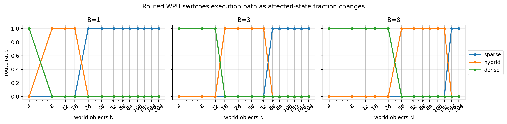
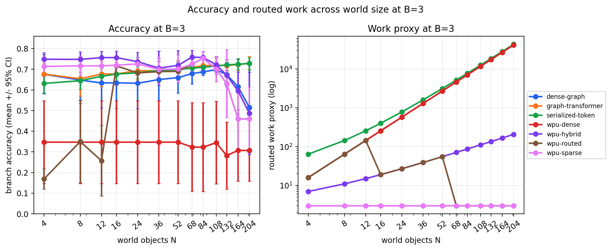
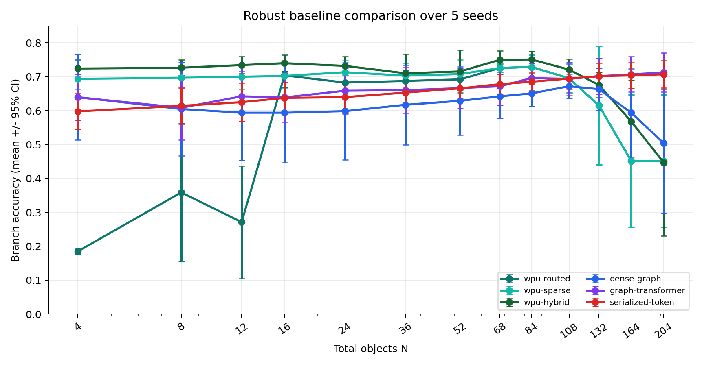
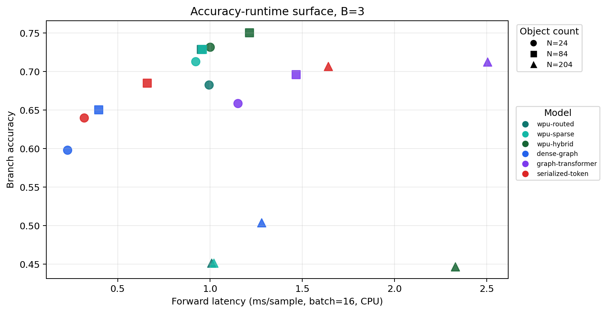
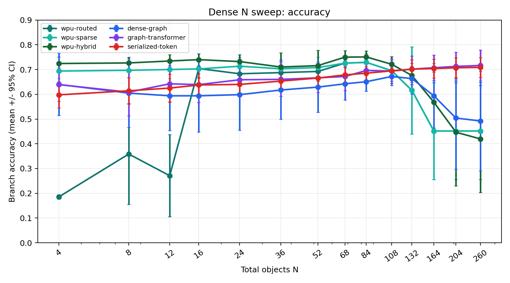
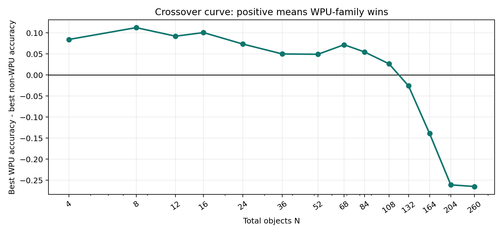
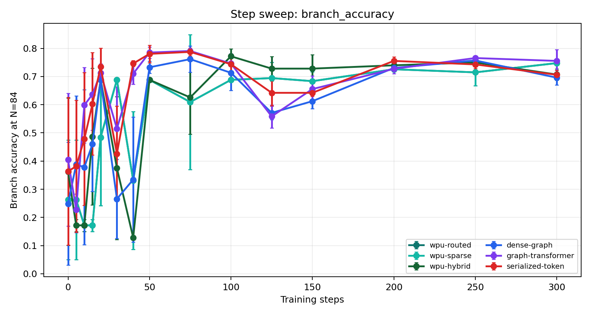

# State Is All You Need: World-State Processing Unit를 향하여

## 초록

토큰 시퀀스는 언어를 처리하기 위한 강력한 계산 단위이지만, 지속적으로
존재하고 변화하는 세계를 처리하기 위한 자연스러운 기본 단위는 아니다.
세계는 단순히 관측되는 것이 아니라 유지되고, 수정되고, 분기되고,
다시 질의되는 상태다. 본 논문은 World-State Processing Unit, 즉 WPU를
제안한다. WPU는 객체, 관계, 시간, 불확실성, 사건, 미래 branch delta를
일급 요소로 두는 state-native 모델 및 실행 추상화다. WPU의 중심 연산은
토큰 attention이 아니라 state propagation이다. 사건은 sparse delta를
만들고, delta는 인과 관계를 따라 전파되며, 영향을 받은 영역은 국소적으로
갱신되고, 국소성이 깨질 때만 dense recomputation으로 전환된다.

우리는 token과 state의 차이, WPU 구조, sparse-dense crossover metric,
그리고 작은 PyTorch reference implementation인 `WorldStateProcessor`를
정의한다. Synthetic robot-cup object physics task에서 v1 prototype은
200 step 학습 후 next-state prediction MSE를 `0.8111`에서 `0.0005`로
낮추고, branch classification accuracy를 `0.1289`에서 `0.7188`로 높였다.
이는 `0.6680` majority baseline을 넘는다. 이 결과는 일반 지능의 증거가
아니라, state-first world model을 검증하기 위한 재현 가능한 출발점이다.
추가 baseline 및 regime sweep은 sparse/hybrid/dense route crossover는
관찰되지만, 큰 state에서 serialized-token baseline도 강하게 작동한다는 점을
보여준다. 따라서 현재 주장은 보편적 우월성이 아니라, state-native processing의
측정 가능한 regime hypothesis다.

## 1. 문제의식

현대 딥러닝의 지배적 추상화는 token sequence다. Token sequence는 position
index를 가진 symbol 또는 embedding의 나열이며, Transformer에서는 attention이
핵심 연산이다. 이 방식은 언어에는 매우 강력하지만, world processing의
구조와는 다르다. 실제 또는 시뮬레이션 세계에는 지속되는 객체, 명시적 관계,
이질적인 속성, 시간적 연속성, 불확실성, 국소적 인과 효과, 그리고 여러
가능한 미래가 존재한다.

이 논문의 질문은 좁고 명확하다.

```text
World processing의 기본 단위는 token이어야 하는가, state이어야 하는가?
```

우리는 token이 state를 표현할 수 없다고 주장하지 않는다. 모든 유한한
state는 token sequence로 직렬화될 수 있다. 그러나 직렬화는 state를 계산
불변량으로 보존하지 않는다. Cup을 text로 설명할 수는 있지만, 그 text
sequence는 object identity, relation locality, delta update, uncertainty,
branch sharing을 일급 연산으로 제공하지 않는다.

핵심 주장은 다음과 같다.

```text
Token = representation of evidence
State = substrate of update
```

Token은 관측 증거를 표현하기 좋다. State는 세계를 수정하고 유지하기 위한
계산 기질이다.

### 중심 논제

World processing은 sequence continuation 문제가 아니라 partial observation
아래에서 변화하는 state를 유지하는 문제다. 따라서 좋은 world model은
object identity, locality, delta update, uncertainty, branching을 모델 밖의
후처리로 밀어내면 안 된다. 이들은 모델과 실행 구조 안에서 일급 연산이어야
한다.

### 기여점

이 원고의 기여는 네 가지다.

1. Token과 state의 차이를 representation 가능성 문제가 아니라 operation
   보존 문제로 정의한다.
2. Propagation을 world-state processing의 중심 연산으로 정의하고, 이를
   단순화된 국소 물리 prior로 해석한다.
3. Sparse, hybrid, dense path를 가진 WPU 구조와 affected-state crossover
   metric을 제안한다.
4. 작은 PyTorch reference implementation과 robot-cup 검증 task를 제공한다.

## 1.5. 선행연구와 위치 지정

두 리뷰의 핵심 지적은 타당하다. WPU는 object-centric learning, GNN, learned
physics simulator, latent world model, sparse Transformer world model과 많은
부분이 맞닿아 있다. 따라서 “완전히 새로운 메시지 패싱 수식”이라고 주장하면
방어하기 어렵다.

관련 선행연구는 다음 축으로 정리된다.

| 연구 흐름 | 대표 예 | WPU와의 관계 |
|---|---|---|
| Object discovery | IODINE, Slot Attention | raw pixel/scene에서 object slot을 찾는 front-end 후보 |
| Graph physics | Interaction Networks, Graph Network-based Simulators | relation message passing과 learned physics의 직접 선행연구 |
| Set/Graph attention | Set Transformer, Graph Transformer | dense/hybrid fallback 또는 graph baseline |
| Latent world model | PlaNet, Dreamer, DreamerV3, IRIS | world model + planning/imagination의 강한 baseline |
| Object-centric world model | STICA, ObjectZero, SPARTAN | object token/graph 기반 world model의 최신 경쟁군 |
| AI accelerator | RPU, neuromorphic/sparse processing surveys | token/reasoning 가속기와 WPU workload의 차이를 설명하는 배경 |

따라서 WPU의 차별성은 “message passing 자체”가 아니다. WPU의 차별성은 다음
운영 단위를 하나의 execution abstraction으로 묶는 데 있다.

```text
persistent state memory
event frontier
sparse/hybrid/dense routing
delta overlay
branch sharing
accuracy-compute-memory surface
```

즉 WPU는 object-centric model이나 GNN simulator를 부정하지 않는다. 오히려 이들을
state-native execution model 안의 구성 요소로 재해석한다. Slot Attention은 state
construction front-end가 될 수 있고, GNS류 message passing은 propagation core가
될 수 있으며, Set/Graph Transformer는 dense fallback이 될 수 있다. WPU가 묻는
질문은 “어떤 neural block이 더 좋은가”가 아니라 “세계 상태를 지속적으로 유지하고
국소 사건을 전파하며 여러 미래를 branch로 관리하는 workload에는 어떤 실행
추상화가 필요한가”이다.

## 2. Token과 State의 차이

Token model은 보통 다음과 같은 입력을 받는다.

```text
X = (x_1, x_2, ..., x_T), x_t in R^d
```

Memory는 sequence context, hidden activation, KV cache처럼 position-indexed
구조다. Transformer의 attention은 다음 질문에 답한다.

```text
이 position은 어떤 다른 position을 참조해야 하는가?
```

반면 world state는 다음과 같은 persistent structured object다.

```text
S_t = {O_t, R_t, T_t, P_t}
```

여기서 `O_t`는 객체 집합, `R_t`는 typed relation graph, `T_t`는 temporal
memory, `P_t`는 uncertainty 또는 belief state다. 사건 `e_t`가 발생하면
state는 append되는 것이 아니라 patch된다.

```text
S_{t+1} = S_t + Delta S_t
```

State model의 핵심 질문은 다르다.

```text
무엇이 바뀌었는가?
어떤 객체가 인과적으로 영향을 받는가?
어떤 relation을 따라 변화가 전파되는가?
어디서 sparse update를 멈추고 dense recompute로 전환해야 하는가?
어떤 미래 branch를 유지해야 하는가?
```

| 속성 | Token sequence | World state |
|---|---|---|
| 기본 단위 | position embedding | object / relation / belief |
| identity | context 안에 암묵적 | object id로 명시적 |
| memory update | append 또는 rewrite | existing state patch |
| relation | attention으로 암묵 추론 | typed edge로 저장 |
| future | continuation | branch overlay |
| training target | next token | next state / delta / branch |

따라서 token과 state의 차이는 data format의 차이가 아니라 computational
primitive의 차이다.

이 구분이 중요한 이유는 representational universality가 computational mismatch를
가릴 수 있기 때문이다. Text string은 database, graph, physical scene을 모두
설명할 수 있다. 그러나 string 자체가 indexed update, referential integrity,
graph traversal, copy-on-write branching을 제공하지는 않는다. WPU의 주장은
token model이 world regularity를 배울 수 없다는 것이 아니다. World-state
operation을 매 timestep마다 sequence position으로부터 재구성하게 만드는 것이
좋은 기본 추상화가 아니라는 주장이다.

## 3. WPU의 필요성

GPU, TPU, NPU는 dense numerical computation에 강하다. LPU 계열 시스템은
token stream 처리에 초점을 둔다. WPU는 다른 workload를 정의한다.

```text
World-state maintenance and update
```

이 workload에는 반복적으로 나타나는 네 가지 성질이 있다.

1. 대부분의 state는 시간에 따라 유지된다.
2. 대부분의 event는 state 전체가 아니라 작은 subset만 바꾼다.
3. 변화는 모든 entity에 균일하게 퍼지지 않고 relation neighborhood를 따라
   전파된다.
4. 미래 불확실성은 full copy가 아니라 공유된 과거 위의 local branch로 나타난다.

모든 timestep마다 state 전체를 dense input으로 다시 처리하는 방식은 이 구조를
이용하지 못한다.

WPU는 현재의 GPU/NPU/TPU를 폐기하자는 주장이 아니다. 오히려 처음에는 그 위에
구현되는 architecture일 수 있다. 그러나 장기적으로는 다음 primitive를
하드웨어/시스템 수준에서 일급 요소로 만들 수 있다.

- object store
- relation fetch
- sparse frontier queue
- delta state log
- branch overlay memory
- sparse-dense scheduler

비교하면 다음과 같다.

| Unit | 주요 workload | 강점 | WPU 대비 차이 |
|---|---|---|---|
| GPU | dense tensor kernel | throughput | graph-local update는 부차적 |
| TPU | matrix/tensor program | systolic dense compute | sparse-dense routing은 외부 정책 |
| NPU | neural layer inference | feedforward 효율 | persistent state memory 없음 |
| LPU | token sequence inference | token latency | object/relation delta가 기본 단위 아님 |
| WPU | world-state processing | local update + branching | state-native primitive |

## 4. WPU의 성능 조건

WPU가 항상 더 빠르다는 주장은 불가능하다. 방어 가능한 주장은 조건부다.

세계에 `N`개의 object가 있고, 한 사건이 처음 바꾸는 object 수가 `DeltaN`,
평균 relation fanout이 `k`, propagation depth가 `h`, branch 수가 `B`라면
affected fraction은 다음과 같다.

```text
rho = (DeltaN * k^h * B) / N
```

Dense recomputation은 대략 `O(N)` 또는 full attention일 경우 `O(N^2)`에
가깝다. WPU sparse propagation은 대략 다음 비용을 가진다.

```text
O(DeltaN * k^h * B)
```

따라서 `rho << 1`이면 sparse state propagation이 dense recomputation보다
유리하다. 반대로 `rho`가 크면 WPU도 dense fallback을 선택해야 한다. 이것이
WPU의 핵심이다.

```text
항상 sparse가 아니라,
sparse가 유리한 구간을 감지하고,
아닐 때는 hybrid/dense로 전환한다.
```

따라서 WPU의 성능 주장은 조건부 명제다.

```text
DeltaN * k^h * B << N 인 workload에서는
state-native sparse update가 dense recomputation보다 낮은 update work를 가진다.
반대로 affected region이 global이면 WPU는 dense path로 수렴해야 하며,
sparse advantage를 주장하지 않는다.
```

이 조건부 성격은 약점이 아니라 장점이다. 주장을 측정 가능하고 반증 가능하게
만들기 때문이다.

## 5. WPU 구조

WPU는 다음 component로 구성된다.

1. State memory: object store, relation graph, temporal buffer, belief store,
   branch delta store.
2. Frontier generator: observation/action/event를 초기 changed object 집합으로
   변환한다.
3. Propagation core: event-conditioned sparse message passing을 relation graph
   위에서 수행한다.
4. Dense fallback: affected fraction이 클 때 global 또는 regional recompute를
   수행한다.
5. Branch manager: 여러 미래를 full copy가 아니라 delta overlay로 유지한다.

Schematic은 다음 구조다.

```text
Observation / Action / Event
        |
Event & Frontier Generator
        |
Propagation Scheduler
   |          |          |
Sparse     Hybrid      Dense
   |          |          |
Branch & Uncertainty Manager
        |
Temporal / Rollout Engine
        |
Updated World State
```

Branch memory는 다음과 같이 표현된다.

```text
Branch = BaseState + DeltaState
```

Full copy 방식이면 memory는 `O(BN)`이다. Delta branch 방식이면 local branch에서
다음으로 줄어든다.

```text
O(N + B * Delta)
```

세계가 크고 branch가 많을수록 이 차이는 중요해진다.

WPU의 memory model은 단순 구현 세부사항이 아니다. Token system은 주로 sequence
position을 cache한다. WPU는 object, typed relation, recent delta, uncertainty,
branch overlay를 cache한다. 의도된 memory operation은 lookup-by-identity,
neighbor-fetch, delta-append, branch-overlay, region materialization이다.

## 6. Attention이 아니라 Propagation

Attention은 WPU 안에서도 유용하다. 특히 dense fallback이나 global consistency
check에는 attention이나 Set Transformer 계열 연산을 사용할 수 있다. 그러나
world-state processing의 정의적 연산은 attention이 아니다.

Token model에서 attention은 다음 질문이다.

```text
which token should this token attend to?
```

State model에서 propagation은 다음 질문이다.

```text
which consequence should this state delta cause?
```

수식으로는 다음과 같이 쓸 수 있다.

```text
Delta o_i^{l+1}
  = f(o_i, e_t, sum_j g(o_i, r_ij, o_j, Delta o_j^l))
```

이는 attention과 비슷한 neural message passing을 사용할 수 있지만, 의미가
다르다. Attention은 representation retrieval이고, propagation은 causal
consequence computation이다.

또한 propagation은 단순화된 물리 원칙으로 해석할 수 있다. 실제 물리 법칙을
정확히 풀겠다는 의미가 아니라, 많은 물리적 변화가 국소 인과 구조를 따라
시작된다는 prior다. 접촉, 지지, 충돌 위험, 가림, 신호 전달은 대개 소수의
객체에서 시작해 가까운 관계를 따라 퍼진다. 이 점에서 WPU의 propagation은
상대론적 정밀 물리 대신 낮은 속도/작은 스케일에서 유용한 뉴턴역학을 쓰는
것과 비슷하다. 정확한 최종 물리는 아니지만, 많은 world-processing 상황에서
계산적으로 유용한 근사다. Dense fallback은 이 국소 근사가 깨질 때 수행하는
global correction으로 볼 수 있다.

핵심 문장은 다음과 같다.

```text
For world processing, propagation is to state what attention is to tokens.
```

중요한 점은 attention을 버리자는 것이 아니다. WPU의 dense fallback에서는
attention이나 Set Transformer 계열 연산이 유용할 수 있다. 다만 world-state
processing의 정의적 연산은 “어디를 참조할까”가 아니라 “이 변화가 어떤 결과를
일으키는가”이다.

## 7. Reference Implementation

현재 저장소의 reference model은 `WorldStateProcessor`다. 입력은
`StateGraphBatch`이며 다음 요소를 포함한다.

- object features
- relation indices
- relation features
- event features
- object mask
- relation mask
- target indices
- time features
- scheduler metrics

모델 출력은 `StatePrediction`이다.

- object delta
- relation logits
- uncertainty
- branch logits
- branch probabilities
- selected execution paths

구현은 세 가지 path를 가진다.

- Sparse path: event target에서 시작하는 learned relation-conditioned message
  passing.
- Hybrid path: sparse update와 regional dense correction의 혼합.
- Dense path: object set 전체에 대한 global attention.

현재 구현은 의도적으로 작다. 최적화된 모델이 아니라 executable specification에
가깝다. 중요한 interface는 structured state graph를 입력으로 받고,
affected-state metric에 따라 route를 고르며, label만이 아니라 delta와 branch
probability를 출력한다는 점이다.

## 8. 소규모 검증

첫 검증 task는 synthetic robot-cup object physics다.

Scene:

- cup
- table
- robot hand
- table edge
- configurable background objects

Relations:

- cup on top of table
- hand near cup
- cup near table edge

Event:

```text
hand_touched_cup(target=cup_001, force=f)
```

Target:

- next object delta
- branch label: stable, falls, caught

이 task는 일반 물리 추론 benchmark가 아니다. WPU 가설의 unit test다. 하나의
neural model 안에서 explicit state graph, local event, sparse-dense route
decision, branch probability가 함께 학습되고 관찰 가능한지를 검증한다.

실험 환경:

- Python 3.11.5
- PyTorch 2.11.0
- CPU execution
- 256 evaluation samples, seed 101
- training: 200 steps, batch size 16, seed 13

결과:

| Model | Next-state MSE | Branch NLL | Branch Accuracy |
|---|---:|---:|---:|
| Untrained WSP | 0.8111 | 1.2070 | 0.1289 |
| Majority baseline | n/a | n/a | 0.6680 |
| Trained WSP | 0.0005 | 0.8074 | 0.7188 |

Routing sweep:

| Background Objects | Sparse Ratio | Hybrid Ratio | Dense Ratio |
|---:|---:|---:|---:|
| 0 | 0.0000 | 0.0000 | 1.0000 |
| 20 | 0.0000 | 1.0000 | 0.0000 |
| 80 | 1.0000 | 0.0000 | 0.0000 |

이 결과의 의미는 두 가지다.

첫째, 모델은 synthetic next-state delta rule을 학습할 수 있다. 둘째, 같은
local event라도 world size에 따라 dense, hybrid, sparse path가 달라진다.
이는 WPU의 핵심 주장, 즉 compute path가 sequence length가 아니라 affected
state fraction에 의해 결정되어야 한다는 점을 보여준다.

이 결과를 과장하면 안 된다. Next-state MSE 개선은 synthetic local delta rule을
배웠다는 뜻이다. 더 중요한 신호는 routing sweep이다. 같은 local event가 작은
세계에서는 dense, 중간 세계에서는 hybrid, 큰 세계에서는 sparse로 바뀐다. 이는
WPU compute가 전체 sequence 길이가 아니라 affected-state fraction의 함수여야
한다는 구조적 주장을 보여준다.

Baseline/ablation 결과도 함께 봐야 한다.

아래 baseline suite는 100 step 학습, 128개 evaluation sample, 동일 synthetic
task에서 수행했다. 이는 위의 200 step primary WSP 결과와 동일한 학습량 비교가
아니라, route 방식과 baseline family의 상대적 경향을 보기 위한 소규모 sweep이다.

| Model | Acc. at N=4 | Acc. at N=24 | Acc. at N=84 |
|---|---:|---:|---:|
| WPU routed | 0.6719 | 0.7969 | 0.6719 |
| WPU sparse | 0.7812 | 0.8047 | 0.6719 |
| WPU hybrid | 0.7812 | 0.7969 | 0.7969 |
| WPU dense | 0.6719 | 0.6719 | 0.6719 |
| Dense graph | 0.4219 | 0.5000 | 0.5938 |
| Serialized token | 0.5625 | 0.6641 | 0.7891 |

이 결과는 WPU가 모든 조건에서 우월하다는 주장을 지지하지 않는다.
Serialized-token baseline은 큰 `N`에서 강하게 나온다. 그러나 이 점이 오히려
논문을 더 과학적으로 만든다. 현재 데이터는 “WPU 보편 우월”이 아니라 “regime
hypothesis”를 지지한다. 즉 어느 구간에서 state-native propagation이 유리하고,
어느 구간에서 token/dense baseline이 충분히 강한지를 accuracy-compute-memory
surface로 검증해야 한다.

### 수정된 Regime Sweep

최신 regime sweep에서는 branch classifier의 출력 class 수를 항상 세 개
(`stable`, `falls`, `caught`)로 고정했다. `B`는 label 수가 아니라 scheduler의
branch pressure만 조절한다. 따라서 서로 다른 `B` 값의 branch accuracy를 직접
비교할 수 있다.

| N | B | rho | Selected route | Routed work proxy | Branch Accuracy |
|---:|---:|---:|---|---:|---:|
| 4 | 3 | 0.750000 | dense | 16.0 | 0.6250 |
| 12 | 1 | 0.083333 | hybrid | 13.0 | 0.7813 |
| 24 | 1 | 0.041667 | sparse | 1.0 | 0.7917 |
| 24 | 3 | 0.125000 | hybrid | 27.0 | 0.7813 |
| 24 | 8 | 0.333333 | dense | 576.0 | 0.6250 |
| 84 | 3 | 0.035714 | sparse | 3.0 | 0.6250 |
| 84 | 8 | 0.095238 | hybrid | 92.0 | 0.7917 |
| 204 | 3 | 0.014706 | sparse | 3.0 | 0.2500 |

이 sweep은 세 가지를 보여준다. 첫째, `rho`가 증가하면 선택 경로가 sparse에서
hybrid, dense로 이동한다. 둘째, 큰 `N`과 작은 affected fraction에서는 routed
work proxy가 매우 작아진다. 셋째, 낮은 work proxy가 곧 높은 accuracy를 보장하지
않는다. 특히 `N=204`에서 routed WPU accuracy가 `0.2500`까지 무너지는 것은 현재
propagation capacity, scheduler, 또는 synthetic distribution이 아직 충분하지
않다는 강한 실패 신호다.

최신 원고에는 두 개의 regime figure를 추가했다.





따라서 현재 실험의 가장 정확한 해석은 다음과 같다.

```text
Efficiency-regime hypothesis: partially supported.
Universal quality dominance over token baselines: not supported yet.
```

### 강화 실험: 5 Seed, 강한 Baseline, Runtime

리뷰 비판을 반영해 추가 실험을 수행했다. 새 실험은 5개 seed
(`11, 13, 17, 19, 23`), 150 training step, 조건당 256 evaluation sample,
`N=4, 24, 84, 204`, branch pressure `B=1, 3, 8`에서 수행했다. Baseline에는
기존 dense graph와 serialized-token 외에 relation-aware `graph-transformer`를
추가했다. 또한 `WorldStateProcessor`가 선택된 path만 실행하도록 수정해 실제
CPU forward latency도 측정했다.

| N | Best WPU | Accuracy | Best non-WPU | Accuracy | 해석 |
|---:|---|---:|---|---:|---|
| 4 | WPU hybrid | 0.7242 ± 0.0260 | Dense graph | 0.6398 ± 0.1257 | WPU variant 우세. Routed scheduler는 dense 선택 때문에 실패. |
| 24 | WPU hybrid | 0.7320 ± 0.0280 | Graph transformer | 0.6609 ± 0.0680 | Medium local regime에서 WPU 우세. |
| 84 | WPU hybrid | 0.7508 ± 0.0244 | Graph transformer | 0.6953 ± 0.0388 | WPU가 가장 강하지만 margin은 제한적. |
| 204 | WPU sparse/routed | 0.4516 ± 0.1957 | Graph transformer | 0.7172 ± 0.0615 | WPU 실패. Token/graph baseline이 accuracy 우세. |

CPU forward latency는 다른 신호를 준다. `B=3`에서 `N=204`의 routed WPU는
`0.7570 ± 0.1756 ms/sample`로 dense graph `1.5470 ± 0.0190`, serialized-token
`1.7522 ± 0.0567`, graph-transformer `2.6152 ± 0.0155`보다 빠르다. 그러나
바로 이 구간에서 WPU accuracy가 무너진다. 따라서 v1의 핵심 tension은 다음이다.

```text
WPU efficiency advantage appears at large N.
WPU accuracy advantage currently appears at medium N.
The unsolved problem is to make these regimes overlap.
```

이 결과는 WPU 논문을 더 강하게 만들지만, 주장은 더 좁아져야 한다. 방어 가능한
주장은 “WPU가 token/graph를 보편적으로 이긴다”가 아니다. 방어 가능한 주장은
“persistent identity, local causal change, branching이 지배적인 medium-local
world-state regime에서 state-native propagation이 경쟁력 있는 accuracy를 보이고,
large-N regime에서는 낮은 routed work와 latency 가능성을 보인다. 그러나 v1은 아직
large-N에서 accuracy와 efficiency를 동시에 달성하지 못한다”이다.

강화 실험 산출물은 `artifacts/robust_v1/`과 `docs/experiments/robust_v1_results.md`에
저장했다. 주요 그림은 다음과 같다.





### 촘촘한 N Sweep: 변화점 추정

기존 `N=4, 24, 84, 204` 네 점은 regime 변화를 찾기에 부족하다. 따라서 추가로
14개 object count에서 dense N sweep을 수행했다.

```text
N = 4, 8, 12, 16, 24, 36, 52, 68, 84, 108, 132, 164, 204, 260
```

동일하게 5개 seed, 150 training step, 조건당 256 evaluation sample을 사용했고,
route/runtime 분석은 `B=3`을 기준으로 했다.

| 변화 유형 | 측정 bracket | 추정 N | 의미 |
|---|---:|---:|---|
| Route: dense → hybrid | 12 → 16 | 16 measured | `rho=3/N < 0.25` 경계 이후 hard scheduler가 hybrid로 전환. |
| Route: hybrid → sparse | 52 → 68 | 68 measured | `rho=3/N < 0.05` 경계 이후 sparse로 전환. |
| Accuracy: best WPU vs best non-WPU | 108 → 132 | 약 120 | v1에서 WPU-family accuracy 우위가 사라지는 지점. |
| Runtime: routed WPU vs serialized-token | 108 → 132 | 약 124 | token baseline보다 routed sparse 실행이 빨라지는 지점. |
| Runtime: routed WPU vs dense-graph | 164 → 204 | 약 178 | dense graph보다 routed sparse 실행이 빨라지는 지점. |

이 결과는 v1의 핵심 문제를 더 정확히 보여준다. Accuracy advantage는 대략
`N≈120`에서 끝나지만, runtime advantage는 serialized-token 대비 `N≈124`,
dense-graph 대비 `N≈178`부터 나타난다. 따라서 다음 목표는 명확하다.

```text
Push the accuracy crossover beyond the runtime crossover.
```

즉 WPU v2는 sparse runtime curve를 유지하면서 accuracy 붕괴 지점을 `N≈178`
이후로 밀어야 한다. 이를 달성하지 못하면 WPU는 “빠르지만 틀리는” regime과
“정확하지만 빠르지 않은” regime이 분리된 채 남는다.





### 촘촘한 B Sweep과 Step Sweep

`N` 외의 축도 촘촘하게 확인했다. 먼저 branch pressure `B`를 기존 `1,3,8` 세
점이 아니라 `1..16` 전체로 sweep했다. 대상 `N`은 `24, 84, 132, 204`다.

| N | Best B | Best Acc. | Best runtime ms/sample | Route changes |
|---:|---:|---:|---:|---|
| 24 | 1 | 0.7258 | 0.6452 | B=1 sparse, B=2 hybrid, B=6 dense |
| 84 | 1 | 0.7531 | 0.7204 | B=1 sparse, B=5 hybrid |
| 132 | 1 | 0.6305 | 0.6050 | B=1 sparse, B=7 hybrid |
| 204 | 1 | 0.4594 | 0.6483 | B=1 sparse, B=11 hybrid |

이 결과는 `B`가 클수록 좋은 것이 아니라는 점을 보여준다. `B`는 output class 수가
아니라 scheduler pressure다. `B`가 증가하면 `rho=B/N`이 증가하고, hard scheduler는
sparse에서 hybrid/dense로 이동한다. 그러나 이 전환이 accuracy를 보장하지 않는다.
특히 `N=24`에서는 `B=6` 이후 dense route로 바뀌며 accuracy가 크게 무너진다. 이는
고정 threshold scheduler가 최종 답이 아니라는 강한 증거다.

다음으로 training step을 `0, 5, 10, 15, 20, 30, 40, 50, 75, 100, 125, 150,
200, 250, 300`으로 촘촘하게 sweep했다. `N=84`, `B=3`, 5 seed 기준이다.

| Model | Best step | Best acc. | Acc. at 50 | Acc. at 150 | Acc. at 300 |
|---|---:|---:|---:|---:|---:|
| WPU routed | 300 | 0.7477 | 0.6883 | 0.6836 | 0.7477 |
| WPU sparse | 300 | 0.7477 | 0.6883 | 0.6836 | 0.7477 |
| WPU hybrid | 100 | 0.7719 | 0.6883 | 0.7281 | 0.7070 |
| Dense graph | 75 | 0.7617 | 0.7328 | 0.6125 | 0.6961 |
| Graph transformer | 75 | 0.7906 | 0.7852 | 0.6555 | 0.7555 |
| Serialized token | 75 | 0.7875 | 0.7805 | 0.6422 | 0.7063 |

이는 단일 training step 결과만으로 모델 우위를 말하면 위험하다는 뜻이다. 많은
모델이 `75~100 step` 근처에서 최고 accuracy를 보이고, 150 이후가 항상 좋아지는
것은 아니다. 따라서 논문에서는 fixed-step accuracy뿐 아니라 learning curve 또는
validation-selected result를 함께 보고해야 한다.

추가 산출물은 `docs/experiments/b_sweep_v1_results.md`와
`docs/experiments/step_sweep_v1_results.md`에 저장했다.




### Controlled Stress: 관계 노이즈와 affected-region 실패 모드

추가로 “잘 되는 조건”이 아니라 “어디서 깨지는가”를 보기 위한 controlled stress
실험을 수행했다. 첫 번째는 irrelevant relation noise다. Cup/table/hand/edge
관계 외에 prediction과 직접 관련 없는 relation edge를 `0, 4, 8, 16, 32, 64,
128`개 추가했다. 두 번째는 affected-background count다. Cup 중심 사건은 유지하되,
background object에도 강한 synthetic delta를 주어 local-update 가정이 얼마나
버티는지 확인했다. 후자는 branch label이 여전히 cup-centric이므로 branch
accuracy보다 affected-background MSE가 더 중요한 지표다.

Relation-noise stress 결과:

| Model | Acc. at noise 0 | Acc. at noise 128 | Acc. drop | MSE multiplier | Cup-MSE multiplier |
|---|---:|---:|---:|---:|---:|
| WPU routed | 0.7289 | 0.6961 | 0.0328 | 30.03 | 1.40 |
| WPU sparse | 0.7289 | 0.6961 | 0.0328 | 30.03 | 1.40 |
| WPU hybrid | 0.7508 | 0.7258 | 0.0250 | 6.60 | 1.36 |
| Graph Transformer | 0.6859 | 0.3422 | 0.3438 | 10.17 | 5.58 |
| Serialized token | 0.6742 | 0.6328 | 0.0414 | 8.52 | 11.64 |

이 실험은 WPU-hybrid에 유리한 강한 신호를 준다. Irrelevant edge가 128개까지
늘어도 WPU-hybrid의 branch accuracy drop은 `0.0250`에 그친다. 반면
Graph Transformer는 `0.3438` 떨어진다. 이는 relation-aware dense graph model이
항상 더 강한 것이 아니라, noisy state graph에서는 frontier/routing control이
중요하다는 점을 보여준다. 즉 모든 relation을 동일하게 처리하는 것이 아니라,
event와 affected frontier를 기준으로 update pressure를 제어해야 한다.

Affected-background stress 결과:

| Model | Best affected-bg MSE | Affected-bg MSE at 64 | Acc. at 64 | Cup MSE at 64 |
|---|---:|---:|---:|---:|
| WPU routed | 0.000269 | 0.000568 | 0.7508 | 0.0182 |
| WPU sparse | 0.000269 | 0.000568 | 0.7508 | 0.0182 |
| WPU hybrid | 0.002344 | 0.002344 | 0.7094 | 0.0186 |
| Graph Transformer | 0.000839 | 0.001014 | 0.7000 | 0.0032 |
| Serialized token | 0.000514 | 0.000514 | 0.7172 | 0.0021 |

이 결과는 더 혼합적이다. 가장 큰 affected count에서는 serialized-token이
affected-background MSE에서 가장 좋고, WPU routed/sparse는 근접하지만 우월하지
않다. 따라서 이 실험은 WPU 주장을 좁힌다. WPU는 noisy local-update regime에서
강한 가능성을 보이지만, affected region이 넓어지는 모든 state-delta regime에서
v1이 우월하다는 증거는 아직 없다.

이 stress package의 결론은 다음과 같다.

```text
Positive result:
  Noisy relation graph에서는 WPU-hybrid/frontier routing이 강한 robustness를 보인다.

Negative or limiting result:
  Global-ish affected background delta에서는 token baseline이 여전히 강하다.

Scientific consequence:
  WPU 주장은 보편 우월성이 아니라 regime-specific computational principle이어야 한다.
```

주요 산출물은 `docs/experiments/controlled_stress_v1_results.md`에 정리했다.


## 9. 반증 가능한 예측

WPU가 과학적 제안이 되려면 실패할 수 있는 예측을 가져야 한다. 현재 제안은
다음 네 가지 예측을 만든다.

1. Locality scaling: `rho << 1`인 구간에서 routed WPU는 같은 품질을 유지하면서
   dense baseline보다 낮은 update work를 가져야 한다.
2. Crossover behavior: `rho`가 증가하면 최적 실행 경로는 sparse에서 hybrid,
   dense로 이동해야 한다.
3. Branch memory: local divergence를 가진 multi-hypothesis rollout에서 delta
   branch는 full state copy보다 적은 memory를 사용하면서 branch identity를
   유지해야 한다.
4. State advantage: object identity가 여러 event에 걸쳐 지속되는 task에서
   state-native model은 serialized-token baseline보다 적은 sample 또는 compute로
   같은 accuracy에 도달해야 한다.

강화 실험은 두 번째 예측, 즉 crossover behavior를 부분적으로 지지한다. 그러나
네 번째 예측, 즉 state advantage는 조건부로만 지지된다. `N=24, 84`에서는
WPU-hybrid가 graph/token baseline보다 높지만, `N=204`에서는 graph-transformer와
serialized-token이 WPU를 명확히 이긴다. 이는 WPU 주장에 대한 중요한 반례
압력이다. 다음 실험은 learned routing, propagation capacity, large-N data balance를
개선한 뒤 같은 5-seed protocol로 반복되어야 한다.

이 예측은 틀릴 수 있다. Controlled benchmark에서 serialized token model이 같은
compute로 WPU와 동등하거나 더 좋다면, WPU는 필수 primitive가 아니다. Sparse
routing이 의미 있는 효율을 주기 전에 accuracy를 해친다면, propagation은 중심
연산으로 부적절하다. 따라서 이 논문은 용어 제안이 아니라 검증 가능한 연구
프로그램이어야 한다.

## 10. 한계

현재 결과는 v1 scaffold다. 다음을 주장해서는 안 된다.

- 일반 지능을 증명했다.
- Transformer보다 항상 우월하다.
- 실제 센서/로봇 데이터에서 물리 dynamics를 검증했다.
- GPU/NPU/TPU보다 항상 빠르다.
- Low work proxy가 실제 wall-clock speedup으로 이어진다고 증명했다.
- 큰 state에서 token baseline보다 항상 좋은 accuracy를 얻는다고 증명했다.

두 review가 지적한 항목 중 아직 완전히 해결되지 않은 부분도 명확히 남아 있다.

- State construction: 현재 WPU는 object/relation state가 이미 주어진다고 가정한다.
  Pixel, point cloud, raw sensor에서 state를 만드는 front-end는 아직 없다.
- Existing work overlap: propagation 수식은 GNN/message passing과 강하게 겹친다.
  차별성은 새 수식이 아니라 state-memory execution abstraction이다.
- Fixed scheduler: `rho < 0.05`, `rho < 0.25` threshold는 v1 engineering default다.
  최적 정책이 아니며 learned router가 필요하다.
- Hardware claim: WPU는 아직 실제 chip design이 아니다. 현재는 PyTorch reference
  model과 workload definition이다.
- Sparse runtime: sparse work proxy가 낮아도 GPU/accelerator에서 실제로 빠르다는
  보장은 없다. Irregular memory access, scatter/gather, kernel overhead를 측정해야 한다.
- State safety: persistent delta update는 잘못된 delta가 state corruption으로 누적될 수
  있다. checkpoint, rollback, consistency check가 필요하다.

현재 방어 가능한 주장은 다음이다.

```text
Explicit world-state processing can be implemented as a learnable architecture
with sparse event propagation, dense fallback, and delta-based branching.
```

즉 “propagation은 실제 물리와 무관한 임의 연산”이 아니다. 더 정확히는
“아직 실제 물리 세계 전체를 이해한다고 검증되지는 않았지만, propagation은
국소 인과 물리의 단순화된 계산 원칙으로 둘 수 있다”가 현재 가장 방어 가능한
표현이다.

특히 현재 prototype은 Python/PyTorch 위의 executable specification이다. Sparse
path의 work proxy는 작지만, 실제 runtime은 Python overhead, 작은 batch size,
dense kernel 최적화 정도에 영향을 받는다. 따라서 hardware claim을 하려면
frontier queue, relation fetch, scatter/gather, branch overlay가 실제 runtime과
memory에서 이득을 내는지를 별도로 측정해야 한다.

또한 `N=204`에서 routed WPU의 accuracy collapse는 논문에 숨기면 안 되는 결과다.
이 실패는 WPU 개념 자체의 반증은 아니지만, v1 propagation block과 hard scheduler가
큰 graph에서 충분한 predictive state를 유지하지 못한다는 것을 보여준다.

## 11. 나아갈 방향

arXiv 수준의 더 강한 논문으로 가려면 다음 실험이 필요하다.

1. `N`, `DeltaN`, `k`, `h`, `B`를 통제할 수 있는 balanced synthetic benchmark.
2. Sparse-only, dense-only, hybrid-only, routed WPU ablation.
3. Graph Transformer, Set Transformer, serialized-token baseline과 비교.
4. Hard rho scheduler와 learned routing head 비교.
5. Branch probability calibration metric.
6. Long-horizon rollout error.
7. CPU/GPU runtime 및 memory profiling.
8. 실제 또는 simulator-backed object dynamics dataset.
9. Matched parameter count, matched training steps, matched wall-clock budget 비교.
10. Output branch class 수와 scheduler branch pressure `B`를 분리한 benchmark suite.
11. Hardware-aware sparse kernels 또는 simulator를 통한 frontier/overlay cost 측정.
12. `N=204` collapse를 설명하기 위한 capacity, receptive field, data-balance ablation.
13. Slot Attention/IODINE류 perception front-end와 WPU state store의 연결.
14. GNS, DreamerV3, IRIS, SPARTAN, STICA, ObjectZero와 matched protocol 비교.
15. Delta corruption을 막기 위한 checkpoint/rollback/state-integrity protocol.

고임팩트 검증은 accuracy만 보고하면 안 된다. `N`, affected fraction, causal
depth, branch 수가 변할 때 accuracy-compute-memory surface를 함께 보고해야 한다.
가장 중요한 실험은 WPU가 하나의 작은 task에서 이기는지가 아니라, 예측한 regime
diagram이 나타나는지다. Local-change regime에서는 state-native propagation이,
global-change regime에서는 dense model이, crossover에서는 hybrid routing이
우세해야 한다.

## 12. 결론

World processing은 단지 세계를 token으로 설명하는 문제가 아니다. 세계는
지속적으로 존재하고, 바뀌며, 여러 미래로 분기되는 state다. WPU는 state를
기본 계산 객체로 두고, propagation을 중심 연산으로 둔다. Token은 관측과
설명에 유용하고, attention은 dense module 안에서 유용하다. 그러나
state-native world model의 정의적 primitive는 token attention이 아니라
state propagation이다.

현재 prototype은 작은 첫 단계다. 그러나 explicit world state,
event-conditioned propagation, sparse-dense routing, branch delta memory를
하나의 학습 가능한 모델로 구현하고 재현 가능한 실험을 제공한다.

Nature/Science급 방향으로 가기 위해 필요한 태도는 보편 우월성을 주장하는 것이
아니다. 새로운 계산 원리, 즉 state-native propagation이 실제로 작동하는 regime을
명확히 제시하고, 그 regime 밖에서는 실패할 수 있음을 열어두며, 이를 반증 가능한
실험으로 만드는 것이다. WPU의 강한 주장은 “항상 더 낫다”가 아니라 “world
processing의 특정 구조, 즉 persistent identity, local causal change, uncertainty,
branching이 지배적인 구간에서는 token continuation보다 state propagation이 더
자연스러운 계산 원리일 수 있다”는 명제여야 한다.
