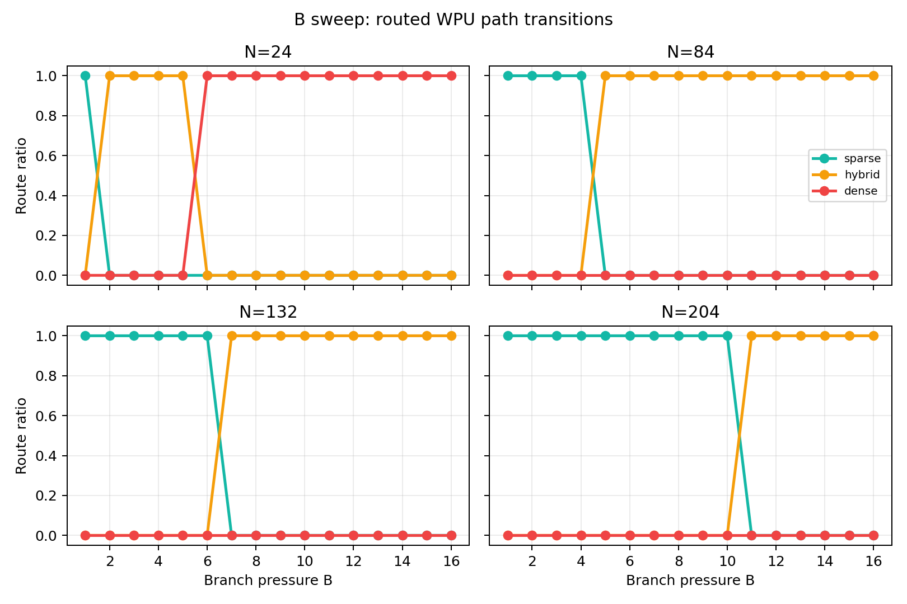
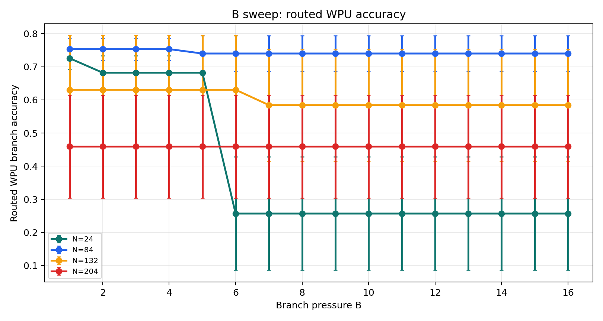
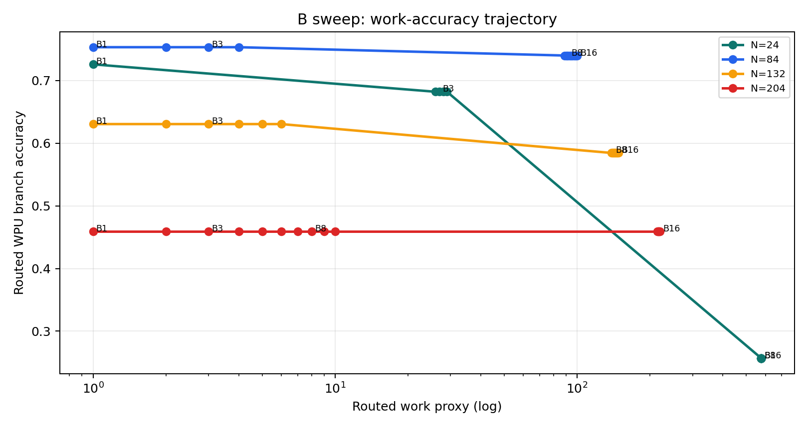
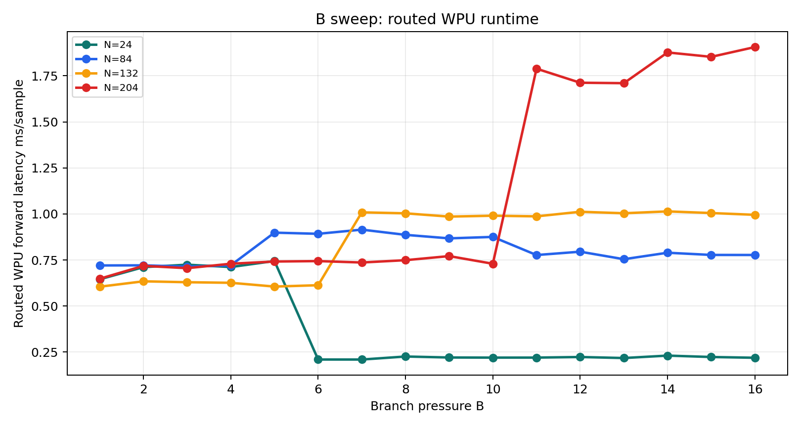

# Dense B Sweep v1 Results

Source CSV: `docs/experiments/b_sweep_v1_summary.csv`

Branch pressure values: `B=1..16`.

N values: `24, 84, 132, 204`.

## Figures

## Routed WPU Summary

| N | best_B | best_acc | best_runtime_ms | best_work_proxy | route_changes |
| --- | --- | --- | --- | --- | --- |
| 24 | 1 | 0.725781 | 0.645193 | 1.0 | B=1:sparse, B=2:hybrid, B=6:dense |
| 84 | 1 | 0.753125 | 0.720389 | 1.0 | B=1:sparse, B=5:hybrid |
| 132 | 1 | 0.630469 | 0.604974 | 1.0 | B=1:sparse, B=7:hybrid |
| 204 | 1 | 0.459375 | 0.648289 | 1.0 | B=1:sparse, B=11:hybrid |

## Interpretation

- `B` is not an output class count; it is scheduler pressure.
- Increasing `B` moves routed WPU toward hybrid/dense paths according to `rho = B/N`.
- Accuracy is not monotonic in `B`; larger branch pressure can trigger dense routing and hurt accuracy.
- The best `B` depends on `N`, which is evidence against fixed thresholds as a final scheduler.
- A learned scheduler should optimize accuracy-latency jointly rather than blindly following hard `rho` thresholds.
