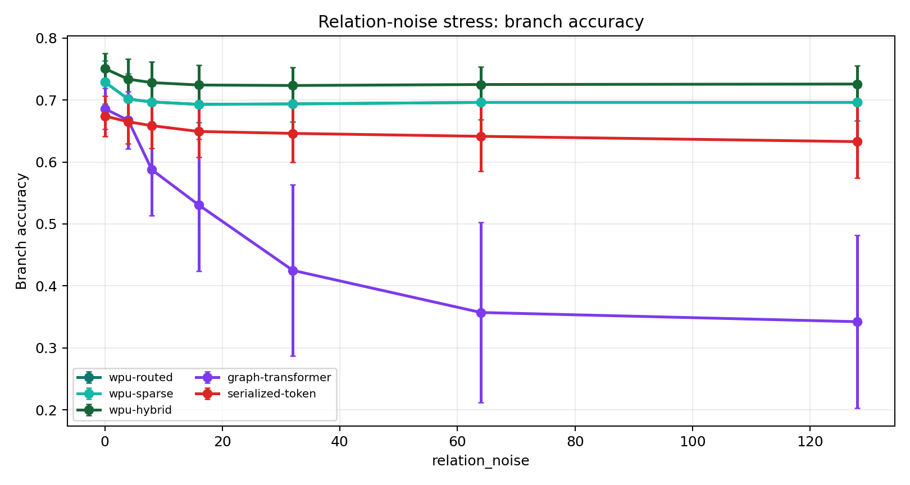
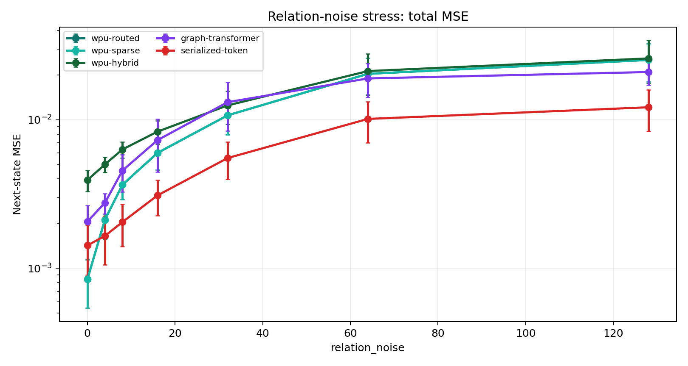
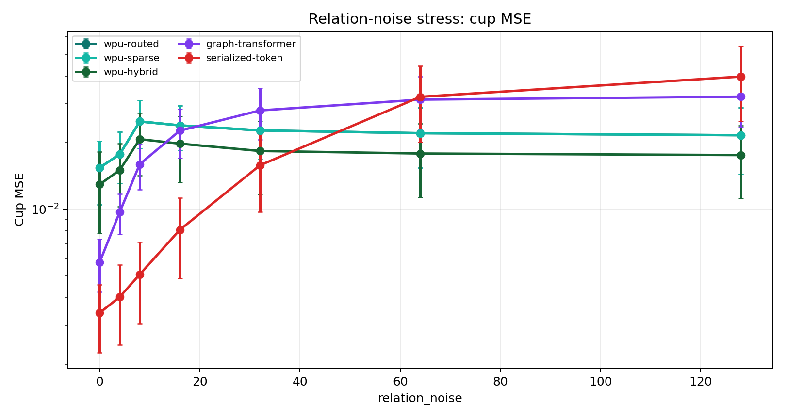
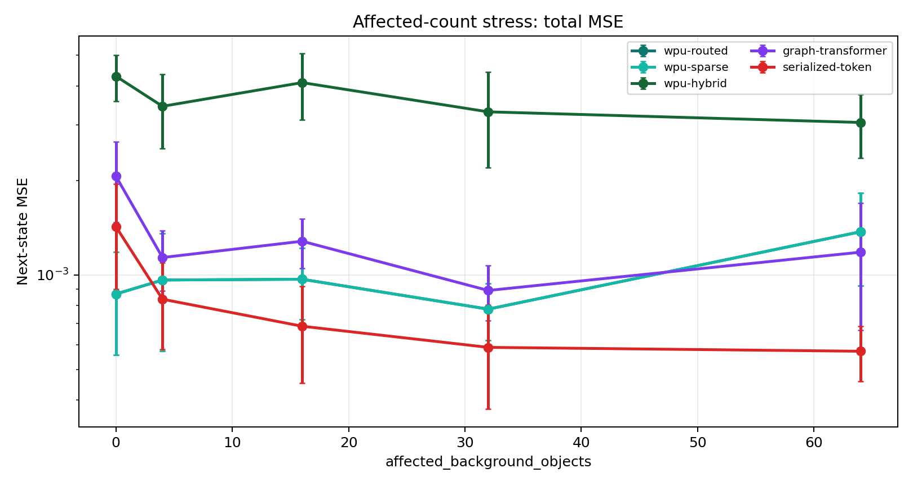
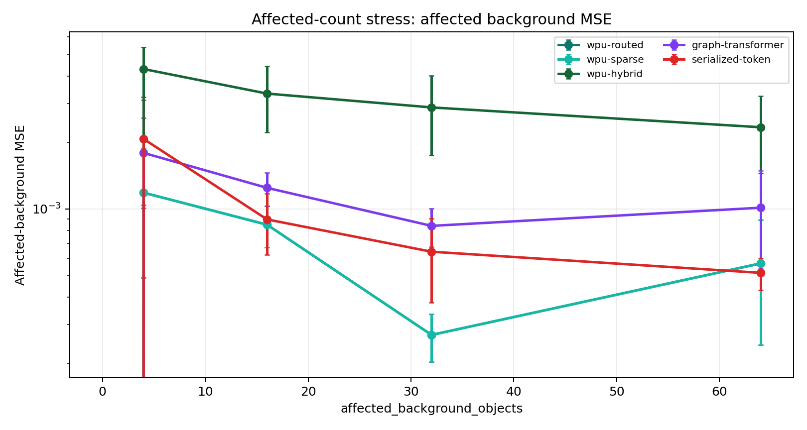
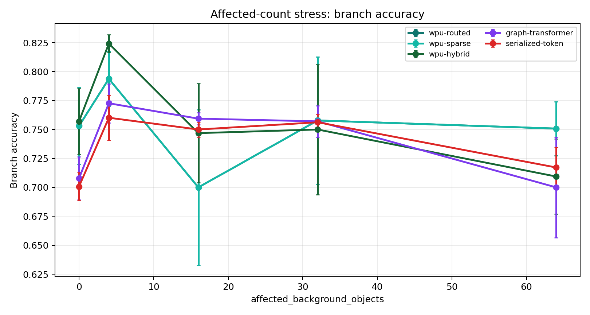

# Controlled Stress v1 Results

Source CSVs:

- `docs/experiments/controlled_stress_v1_relation_noise_summary.csv`
- `docs/experiments/controlled_stress_v1_affected_count_summary.csv`

These experiments test failure modes, not just best-case performance.

Relation-noise values: `0, 4, 8, 16, 32, 64, 128`.
Affected-background counts: `0, 4, 16, 32, 64`.

## Figures

## Relation-Noise Summary

| model | acc_at_0 | acc_at_128 | acc_drop | mse_multiplier | cup_mse_multiplier |
| --- | --- | --- | --- | --- | --- |
| wpu-routed | 0.728906 | 0.696094 | 0.032813 | 30.033 | 1.401 |
| wpu-sparse | 0.728906 | 0.696094 | 0.032813 | 30.033 | 1.401 |
| wpu-hybrid | 0.750781 | 0.725781 | 0.025 | 6.598 | 1.355 |
| graph-transformer | 0.685937 | 0.342188 | 0.34375 | 10.165 | 5.582 |
| serialized-token | 0.674219 | 0.632812 | 0.041406 | 8.519 | 11.642 |

## Affected-Count Summary

| model | best_bg_count | best_bg_mse | bg_mse_at_64 | acc_at_64 | cup_mse_at_64 | total_mse_change_0_to_max |
| --- | --- | --- | --- | --- | --- | --- |
| wpu-routed | 32 | 0.000269 | 0.000568 | 0.750781 | 0.018155 | 0.000503 |
| wpu-sparse | 32 | 0.000269 | 0.000568 | 0.750781 | 0.018155 | 0.000503 |
| wpu-hybrid | 64 | 0.002344 | 0.002344 | 0.709375 | 0.018646 | -0.001233 |
| graph-transformer | 32 | 0.000839 | 0.001014 | 0.7 | 0.003176 | -0.000879 |
| serialized-token | 64 | 0.000514 | 0.000514 | 0.717188 | 0.002058 | -0.000852 |

## Interpretation

- Relation-noise robustness is strongest for `wpu-hybrid` by accuracy drop and weakest for `graph-transformer`.
- The graph-transformer baseline degrades sharply under irrelevant extra edges, which supports the need for explicit route/frontier control in noisy state graphs.
- WPU-hybrid preserves branch accuracy under noise better than sparse-only WPU, suggesting that local propagation needs regional correction rather than pure locality.
- Under strong affected-background deltas, `serialized-token` has the lowest affected-background MSE at the largest affected count.
- The affected-count task is not well measured by branch accuracy because the branch label is still cup-centric; background-delta MSE is the relevant failure-mode metric.
- These results refine the claim: WPU is promising in noisy local-update regimes, but v1 does not yet prove broad state-delta superiority across all affected-region regimes.
