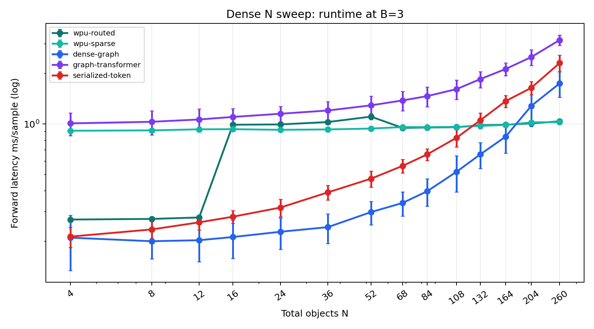
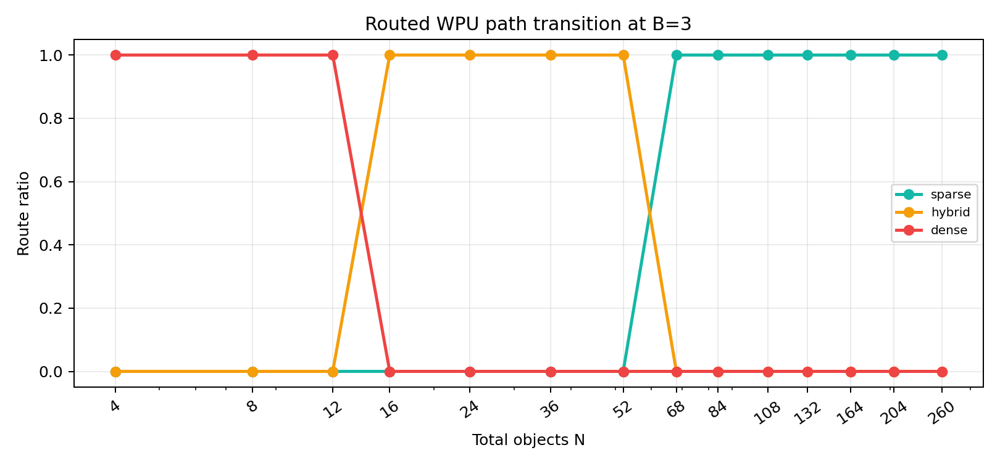

# Dense N Sweep v1 Results

Branch pressure for route/runtime analysis: `B=3`.

N values: `4, 8, 12, 16, 24, 36, 52, 68, 84, 108, 132, 164, 204, 260`.

## Figures

## Route Change Points

| first_N | dominant_route |
| --- | --- |
| 4 | dense |
| 16 | hybrid |
| 68 | sparse |

## Accuracy Crossover Table

| N | best_wpu | best_wpu_acc | best_non_wpu | best_non_wpu_acc | acc_gap_wpu_minus_non | wpu_routed_acc | wpu_routed_runtime_ms | serialized_token_runtime_ms | graph_transformer_runtime_ms | routed_work_proxy |
| --- | --- | --- | --- | --- | --- | --- | --- | --- | --- | --- |
| 4 | wpu-hybrid | 0.724219 | dense-graph | 0.639844 | 0.084375 | 0.185157 | 0.269272 | 0.212983 | 1.008369 | 16.0 |
| 8 | wpu-hybrid | 0.726563 | serialized-token | 0.614062 | 0.1125 | 0.358594 | 0.271617 | 0.235064 | 1.030343 | 64.0 |
| 12 | wpu-hybrid | 0.734375 | graph-transformer | 0.642188 | 0.092187 | 0.271094 | 0.276979 | 0.259094 | 1.063467 | 144.0 |
| 16 | wpu-hybrid | 0.739844 | graph-transformer | 0.639063 | 0.100781 | 0.703906 | 0.989143 | 0.279921 | 1.101378 | 19.0 |
| 24 | wpu-hybrid | 0.732031 | graph-transformer | 0.658594 | 0.073438 | 0.682812 | 0.993838 | 0.317358 | 1.150459 | 27.0 |
| 36 | wpu-hybrid | 0.710156 | graph-transformer | 0.660156 | 0.05 | 0.6875 | 1.026618 | 0.391044 | 1.2029 | 39.0 |
| 52 | wpu-hybrid | 0.715625 | graph-transformer | 0.666406 | 0.049219 | 0.692187 | 1.10613 | 0.471843 | 1.291553 | 55.0 |
| 68 | wpu-hybrid | 0.75 | serialized-token | 0.678125 | 0.071875 | 0.725781 | 0.947784 | 0.561908 | 1.380799 | 3.0 |
| 84 | wpu-hybrid | 0.750781 | graph-transformer | 0.696094 | 0.054688 | 0.728906 | 0.952547 | 0.658664 | 1.465424 | 3.0 |
| 108 | wpu-hybrid | 0.721094 | serialized-token | 0.694531 | 0.026563 | 0.695313 | 0.956576 | 0.828467 | 1.614086 | 3.0 |
| 132 | wpu-hybrid | 0.675781 | graph-transformer | 0.701563 | -0.025781 | 0.615625 | 0.982494 | 1.050505 | 1.850081 | 3.0 |
| 164 | wpu-hybrid | 0.567969 | graph-transformer | 0.707031 | -0.139063 | 0.451563 | 0.989894 | 1.368091 | 2.126612 | 3.0 |
| 204 | wpu-routed | 0.451563 | graph-transformer | 0.7125 | -0.260937 | 0.451563 | 1.008346 | 1.64144 | 2.503171 | 3.0 |
| 260 | wpu-routed | 0.451563 | graph-transformer | 0.716406 | -0.264844 | 0.451563 | 1.036429 | 2.308716 | 3.164099 | 3.0 |

## Interpretation

- WPU-family wins at N values: `4, 8, 12, 16, 24, 36, 52, 68, 84, 108`.
- Non-WPU family wins at N values: `132, 164, 204, 260`.
- Routed WPU is faster than both serialized-token and graph-transformer at N values: `132, 164, 204, 260`.
- The important crossover is not a single number. Accuracy, route, and runtime cross at different N ranges.
- The v1 target is to move the accuracy crossover rightward while preserving the runtime crossover.

## Estimated Change Points

The measured grid is discrete, so the following values are approximate linear
interpolations between adjacent measured N values.

| Change type | Measured bracket | Estimated N | Meaning |
| --- | --- | ---: | --- |
| Routed path: dense to hybrid | 12 to 16 | 16 measured | Hard scheduler switches after the theoretical `rho=3/N < 0.25` boundary. |
| Routed path: hybrid to sparse | 52 to 68 | 68 measured | Hard scheduler switches after the theoretical `rho=3/N < 0.05` boundary. |
| Accuracy: best WPU vs best non-WPU | 108 to 132 | about 120 | WPU-family advantage disappears beyond this scale in v1. |
| Runtime: routed WPU vs serialized-token | 108 to 132 | about 124 | Routed sparse execution becomes faster than token serialization after this scale. |
| Runtime: routed WPU vs dense-graph | 164 to 204 | about 178 | Routed sparse execution becomes faster than the dense graph baseline after this scale. |

The central v1 gap is now quantitatively sharper: accuracy advantage ends around
`N≈120`, while routed runtime advantage begins around `N≈124` versus token and
`N≈178` versus dense graph. The next architecture target is therefore to push
the accuracy crossover beyond `N≈178` without losing the sparse runtime curve.
