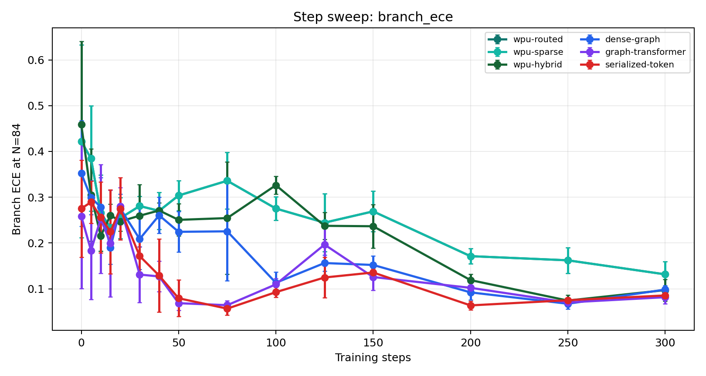
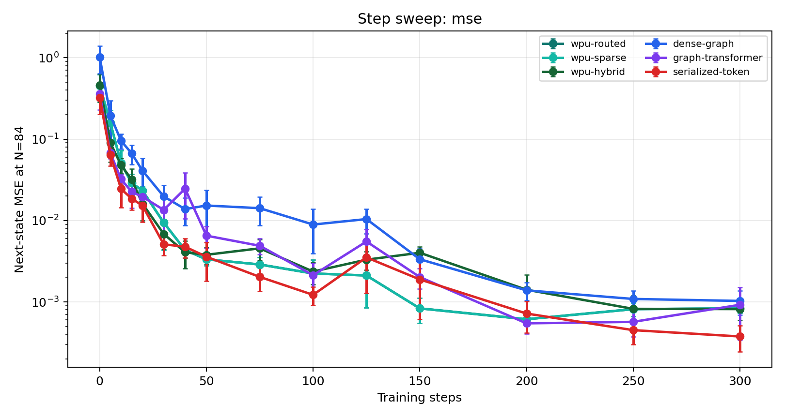

# Dense Step Sweep v1 Results

Training steps: `0, 5, 10, 15, 20, 30, 40, 50, 75, 100, 125, 150, 200, 250, 300`.

Evaluation: `N=84`, `B=3`, 5 seeds, 256 samples per evaluation point.

## Figures

## Summary

| model | best_step | best_acc | acc_at_50 | acc_at_150 | acc_at_300 | gain_150_to_300 |
| --- | --- | --- | --- | --- | --- | --- |
| wpu-routed | 300 | 0.747656 | 0.688281 | 0.683594 | 0.747656 | 0.064063 |
| wpu-sparse | 300 | 0.747656 | 0.688281 | 0.683594 | 0.747656 | 0.064063 |
| wpu-hybrid | 100 | 0.771875 | 0.688281 | 0.728125 | 0.707031 | -0.021094 |
| dense-graph | 75 | 0.761719 | 0.732813 | 0.6125 | 0.696094 | 0.083594 |
| graph-transformer | 75 | 0.790625 | 0.785156 | 0.655469 | 0.755469 | 0.1 |
| serialized-token | 75 | 0.7875 | 0.780469 | 0.642188 | 0.70625 | 0.064063 |

## Interpretation

- Most useful learning happens before 100-150 steps on this synthetic task.
- Longer training does not uniformly improve branch accuracy.
- This weakens any claim based on a single training duration; results should report training curves or best-validation selection.
- For future papers, step budget should be treated as an axis in the accuracy-compute surface.
